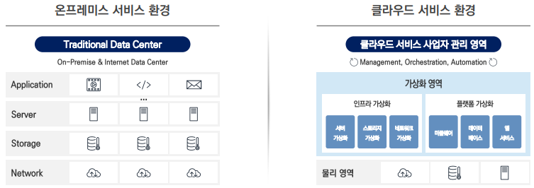
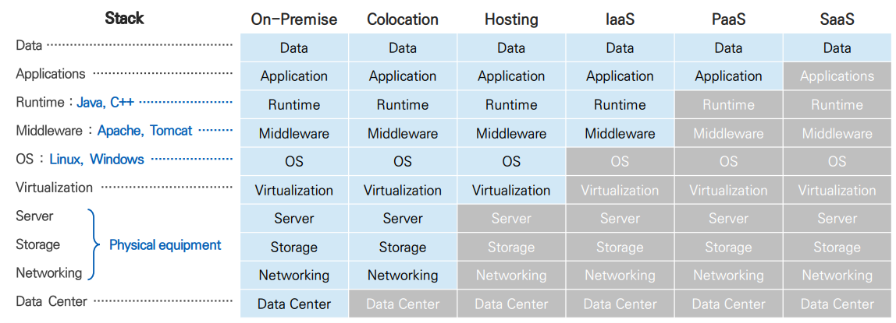
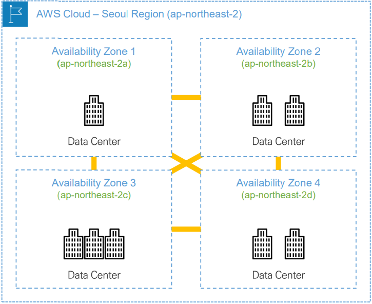
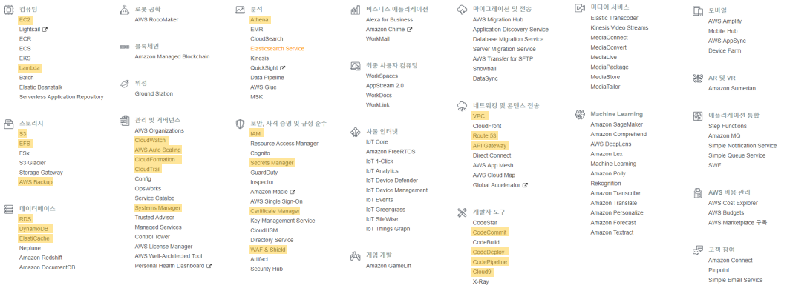
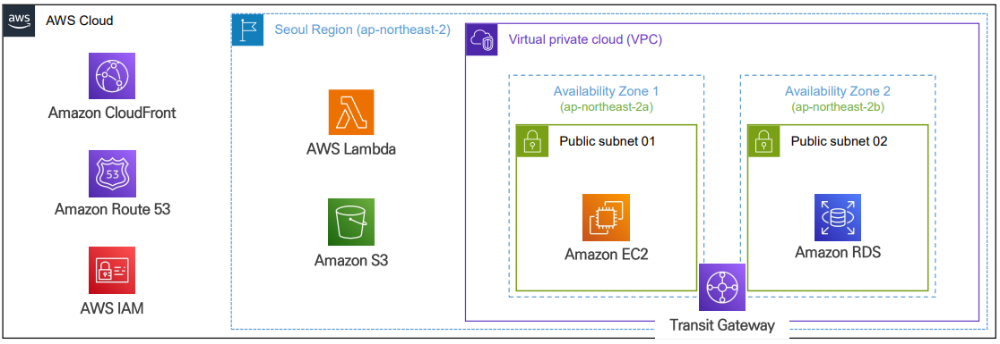
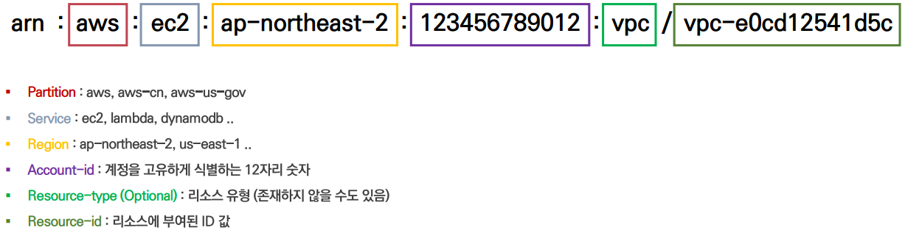
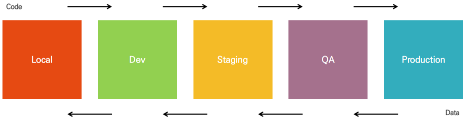
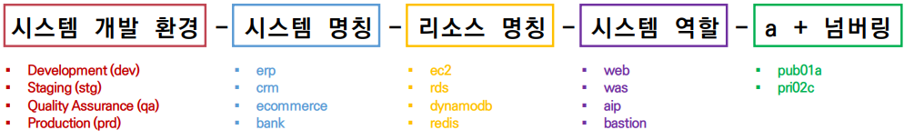

# Cloud Fundamental

## 1. Overview of Cloud

### **클라우드 컴퓨팅이란?**

- **IT 리소스를 인터넷 기반 On-Demand 주문 방식으로 서비스 하는 개념**

**클라우드 컴퓨팅 특징**

- **리소스 공유** : 여러 사용자가 공유
- **신속한 확장** : 스케일업, 스케일다운
- **주문형 셀프 서비스** : 관리화면을 통해 서비스 이용
- **측정 가능한 서비스** : 이용한 만큼 요금 부과

 

### **Data Center**

- **서버를 호스팅하기 위한 시설**
- 컴퓨팅 시스템, 네트워킹 장비, 저장장치
- 전원공급 장치 및 케이블, 전기 시스템, 비상 발전기
- 환경 조절 장치 (냉각장치, 습도 조절 장비, 정전기 방지, 화재 예방 장비)
- 운영 관리 인력

**Data Center 직접 운영 관리 시 발생하는 어려움**

- 높은 **운영 관리 비용** (건물 유지비, 시스템 구매, 유지보수 등)
- 구매한 장비나 건물의 **수요와 관계 없이 유지**해야 하는 단점
- 구축 소요 시간이 길어 수요가 증가할 경우 **신속한 확장**의 어려움

 

### **클라우드**

- IT Infrastructure를 일종의 서비스 형태로 제공
- **하드웨어로 구성된 인프라의 물리 영역을 논리적으로 재구성하여 소프트웨어 방식으로 서비스를 제공**

 

## 2. Cloud Computing Deployment Model

> 배포 형태에 따라 구분
> 
**Public Cloud**  
    클라우드 서비스 공급자의 컴퓨팅 자원을 공유해서 사용  

**Private Cloud**  
    조직 내부에 구성해 내부망을 통해 서비스되는 컴퓨팅 리소스 
 
**Hybrid Cloud**  
    Public & Private Cloud를 연결하여 사용되는 형태   
    
**Multi Cloud**  
    다수의 클라우드 사업자의 클라우드 서비스로 구성된 환경

 

## 3. Cloud Computing Model

 

## 4. Introduction to the AWS Cloud

 ](img/image2.png)

[AWS 글로벌 인프라](https://aws.amazon.com/ko/about-aws/global-infrastructure/regions_az/) 

 

### **AWS Regions**

- AWS Service가 제공되는 **물리적인 위치**
- 전 세계 **36개의 리전**으로 분리 구성
- 리전 별 서비스 구분을 위한 **고유 코드** 존재
    - 리전 코드 구조 = (지역) + (지리적 위치) + (순번)
    - 예시) ap-northeast-2
- **리전 별 제공되는 서비스는 다르다**.

 

### **Availability Zones**

- Region에 배치된 **하나 이상의 데이터센터 그룹**
- 1개의 리전에는 최소 **3개 이상의 AZ**로 구성
- 1개의 AZ에는 **1개 이상의 데이터센터**로 구성
- 각 가용영역은 상호 **100Km** 내외의 거리를 **이격**하여 구성
    - 가용영역 간 네트워크는 **전용선**으로 연결
- 가용영역 구분을 위한 **고유 코드** 존재
    - 리전 코드 구조 = (지역) + (지리적 위치) + (순번) + **(가용영역 코드)**
    - 예시) ap-northeast-2**a**

 

### **AWS Cloud Main Service List**

 

### **AWS Global, Region, VPC Service Placement**

글로벌 → 검은색 / Region → 하늘색 점선 / VPC 종속 → 보라색

 

### **ARN(Amazon Resouce Name)**

- AWS가 서비스를 고유하게 식별하기 위해서 부여하는 네이밍 컨벤션

 

### **시스템 개발 환경의 분류**

- Dev
    - 팀원이 각자 개발한 기능에 대한 테스트가 필요한 경우
- Staging
    - 배포가 되기 직전에 테스트하는 경우
    - 운영 환경이랑 거의 동일한 환경(99%)을 가져가야 한다.
        - 방화벽, 보안제품, NAS 등의 많은 것들이 들어가있는데 그걸 동일한 환경으로 만드는 것은 무리가 있기 때문에 Staging을 하는 것보다는 Dev 단계에서 하는 편이 많다.

 

### **kubab-case**

- 사용자가 생성한 리소스의 네이밍 컨벤션
- 예시) `prd-ecommerce-vpc`, `dev-cwave-ec2-web-01a`, `stg-edu-rds-db-01`