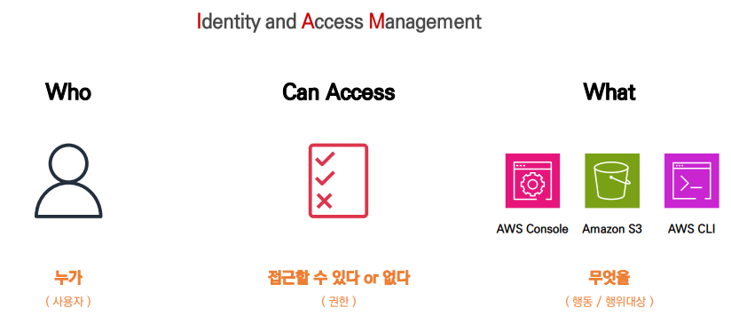
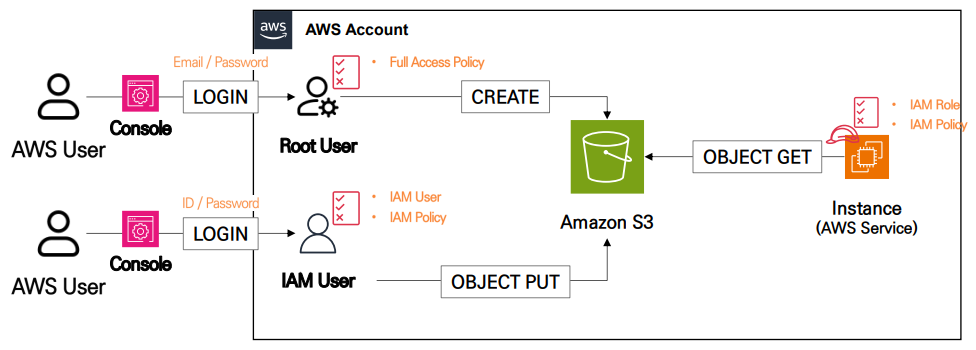
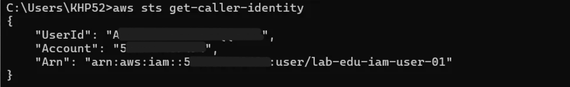
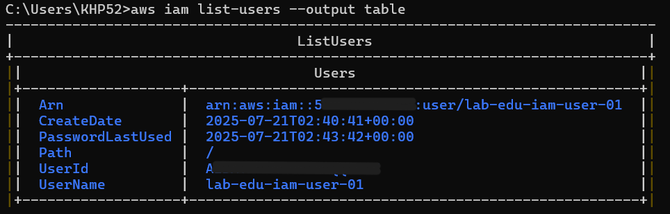
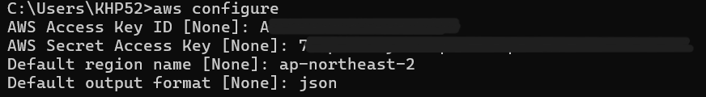

# IAM



### Identity

- IAM에서 Identity는 **보안주체**(Principal)로 표현한다.

| Root User(Account)                                                                | IAM User                                                                      | IAM Role                                                                | AWS Service(Application)                                           |
| --------------------------------------------------------------------------------- | ----------------------------------------------------------------------------- | ----------------------------------------------------------------------- | ------------------------------------------------------------------ |
| • 모든 권한 소유 <br/> • 초기 설정 후 사용 지양 <br/> • 등록된 이메일 주소로 접근 | • 부여된 권한만 행사 <br/> • 장기자격증명 <br/> • 생성된 자격(ID/PW)으로 접근 | • 부여된 권한만 행사 <br/> • 임시자격증명 <br/> • AWS API를 사용해 접근 | • 사용자 대신 작업 수행 <br/> • IAM User / IAM Role 이용 작업 수행 |

<br/>

### Access Management

- IAM은 **JSON 구조**로 구성된 **정책(Policy) 문서**를 기반으로 사용자의 **권한을 관리**한다.

```json
{
	"누가"            : "IAM User / AWS Service / ..."
	"무엇을(대상)"    : "S3 / EC2 / DynamoDB / ..."
	"어떻게(행위)"    : "Get / Delete / Create / ..."
	"할 수 있다/없다" : "허용 / 거부"
}

# 예시
{
    "Version": "2012-10-17",
    "Statement": [
        {
            "Effect": "Allow",
            "Action": "*",
            "Resource": "*"
        }
    ]
}
```

<br/>

### Root User

- 계정 생성시 발급되는데, **초기 설정 후 사용하지 않는 것을 권장**
- 초기 설정 과정
  1. Root User MFA 설정
  2. Password Policy 설정
  3. 대체 연락처 설정
  4. Admin User 생성
     ⇒ 이후 특정 작업 제외한 모든 작업에서 Root User 사용 제한

<br/>

### AWS User와 AWS Service를 위한 Identity System 동작 구조



<br/>

## [실습](https://github.com/honi20/CloudWave/tree/main/AWS/99_Practice/05.%20Storage%20Service%20-%20EBS)






