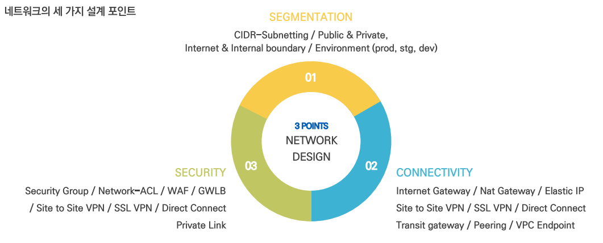
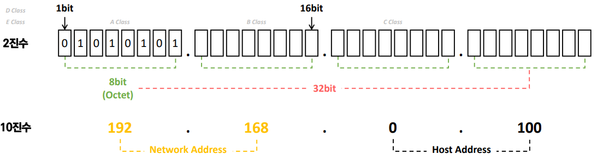
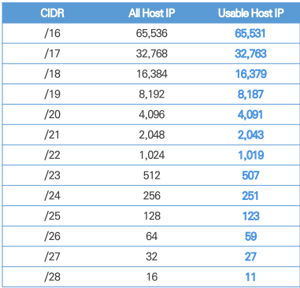
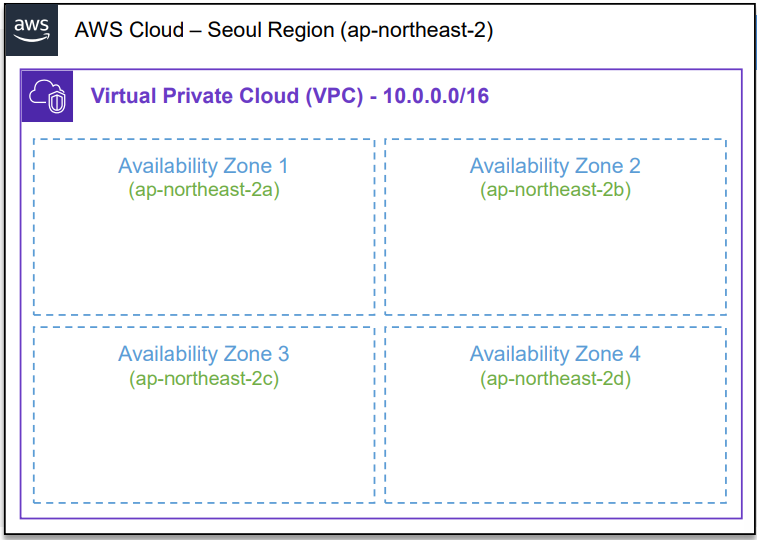
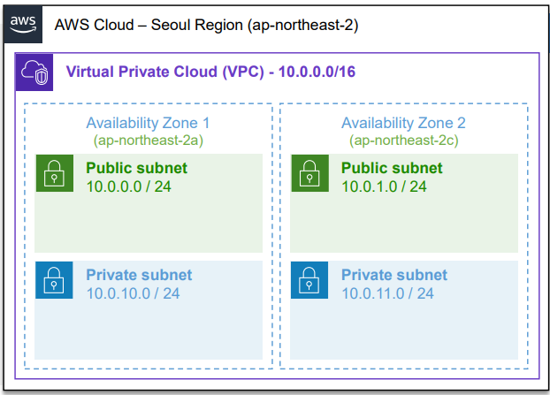
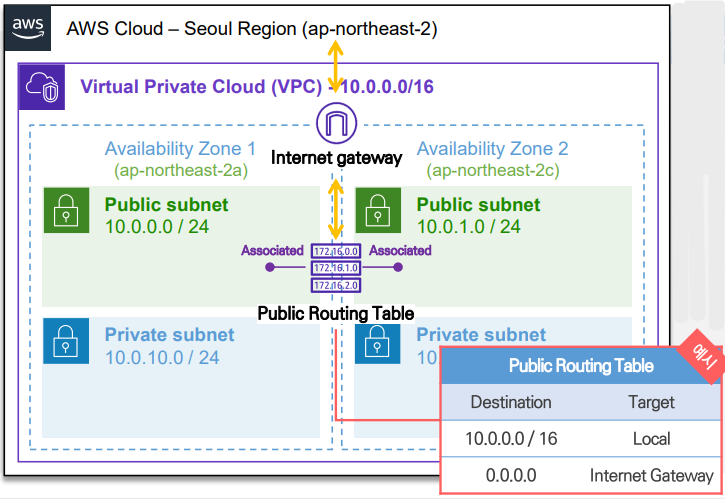
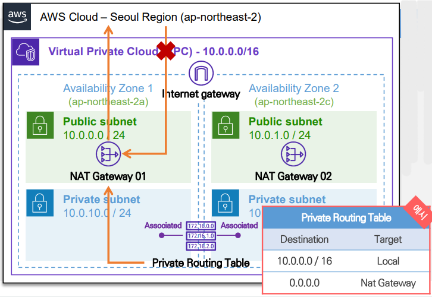
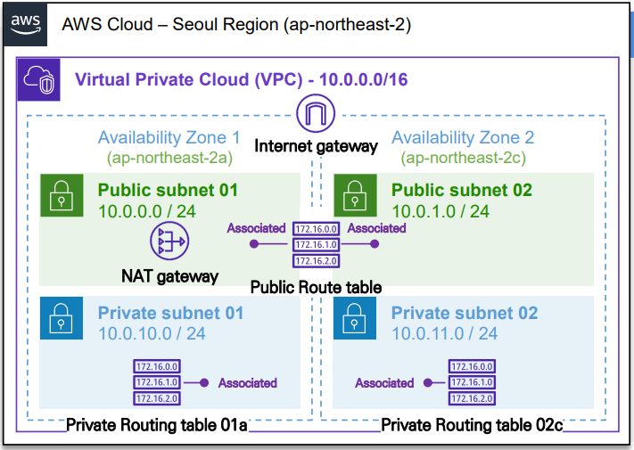
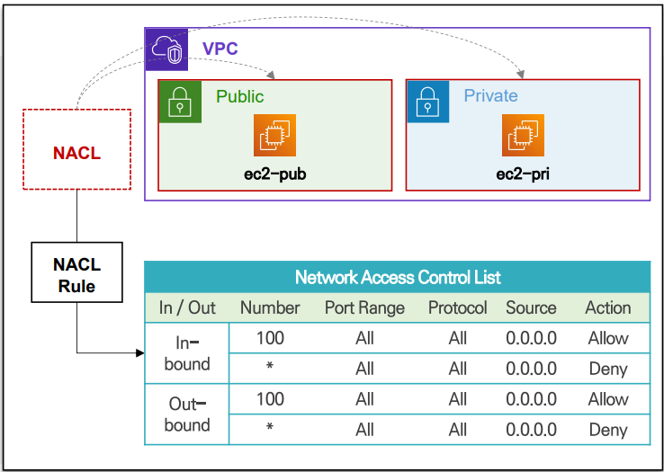
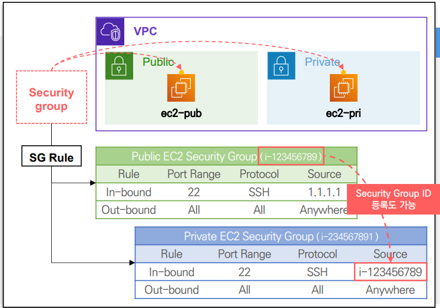

# Network Baseline

## Network Design Fundamental



<br/>

### Internet Protocol Address & Classless Inter-Domain Routing

- IP Address는 Internet에 연결된 장치를 **식별 가능하게 해주는 고유 주소**
- Classful 할당 방식 보다 IP 주소를 더 효율적으로 사용하기 위해 **CIDR (Classless Inter-Domain Routing)**을 이용해 **네트워크 주소와 호스트 주소로 구분**



<br/>

### RFC 1918 – Standard Private IP Address

- RFC 1918 문서에서 **Private IP Address Range**를 표준으로 지정
- 내부 네트워크망 구성은 Private IP Address Range 내 할당
    - **Public IP Address Range를 할당 할 경우 IP 충돌**
    - Super-netting & Subnetting을 이용해 CIDR 형태로 유연하게 네트워크 지정
- Private IP Address Range
    
    
    | IP 범위 | CIDR | IP 주소 개수 |
    | --- | --- | --- |
    | 10.0.0.0 ~ 10.255.255.255  | 10.0.0.0/8  | 16,777,216 |
    | 172.16.0.0 ~ 172.31.255.255  | 172.16.0.0/12  | 1,048,576 |
    | 192.168.0.0 ~ 192.168.255.255  | 192.168.0.0/16 | 65,536 |

<br/>

### Usable IP Address Range in AWS VPC per CIDR

- AWS에 의해 예약된 IP를 제외 나머지 자유롭게 사용
- Default Network Reserved Host IP
    - `x.x.x.0` : Network Address
    - `x.x.x.255` : Broadcast Address
- AWS Reserved Host IP
    - `x.x.x.1` : VPC Router
    - `x.x.x.2` : DNS Server
    - `x.x.x.3` : Future use
- **Reserved Host IP는 Subnet 마다 지정되어 실제는 표에서 제시된 Usable Host IP 보다 적다.**



<br/>

## Virtual Private Cloud

### VPC

- 다른 네트워크 환경 및 외부와 격리된 **가상의 사설 네트워크**
    - 사용자가 원하는 IP 대역을 **CIDR Block 단위로 할당**하여 네트워크 구성
    - CIDR Block은 **최소 /28 ~ 최대 /16** 범위 내 지정
    - **최대 5개** 생성 가능 (AWS 요청 시 추가 가능)
- 한 번 설정한 **VPC CIDR 대역은 수정 불가능**
- Secondary CIDR Block 추가를 통해 네트워크 확장 가능
    - **최대 5개** 추가 가능 (AWS 요청 시 추가 가능)
- **Region에 종속**된 리소스이며, **복수 Region**에 걸쳐 **확장**된 VPC **구성 제한**
    - Region 내부에 구성된 **Availability Zone**을 **VPC 내부에서 자유롭게 사용 가능**
- 대부분의 AWS 서비스는 VPC에 의존성을 가지기 때문에 **VPC에 대한 이해가 필요**



<br/>

### Subnet

- Amazon VPC 네트워크 내부에 **더욱 세분화한 네트워크**
- VPC CIDR Block IP를 **더 작은 네트워크 단위로 분할**한 단위
- VPC 내 **N개의 Subnet 생성 가능**
- Subnet은 **하나의 가용영역**에 배치
    - 여러 AZ에 걸쳐 Subnet 확장 생성 불가능
- **Routing Table 리소스**를 이용해 **Public & Private Subnet**으로 구분하여 사용

<br/>

**Public Subnet**

- 외부에서 접근 가능한 네트워크 영역 (인터넷망)

**Private Subnet**

- 외부에서 접근 불가능한 네트워크 영역 (내부 통신만 가능)
- Private Subnet 내부 리소스가 외부로 통신하는 트래픽만 허용 가능



<br/>

### Internet Gateway & Public Routing Table

- 외부와 격리된 VPC는 **Internet Gateway를 통해서만 인터넷과 통신 가능**
    - Internet Gateway는 생성 후 VPC에 할당하여 사용
    - 1개의 VPC에는 1개의 Internet Gateway만 할당 가능
- **격리된 Network 간**에 통신이 가능하도록 구성하는 **Routing Table**
    - 특정 IP로 패킷을 보낼 때 라우터가 어디로 전달해야 하는지 정보를 테이블 형태로 관리
- 인터넷 통신을 위해서 **Routing Table에 Internet Gateway 정보 등록 필요**
    - **Internet Gateway** 정보가 등록된 라우팅 테이블을 **Public Routing Table** 이라 표현
    - **Public Routing Table**이 할당된 Subnet을 **Public Subnet** 이라 표현
    - Public Subnet의 리소스 들은 **인터넷 구간과 내/외부 양방향 통신 가능**
    - Subnet은 Routing Table 1개만 할당 가능 → Routing Table은 복수 Subnet에 적용 가능



<br/>

### NAT Gateway & Private Routing Table

- **Nat Gateway**을 통해 **Private Subnet의 리소스도 인터넷 접속 허용**
    - Private Subnet의 리소스들이 **Nat Gateway의 Public IP를 공유**해 인터넷 이용
    - Private Subnet 내부 리소스가 **외부로 접근하는 경우만 허용**
        - *외부에서 내부로 접속하는 트래픽은 처리 불가*
- 인터넷 접근이 가능한 **Public Subnet에 구성 및 Routing Table에 정보 등록 필요**
    - 인터넷 접속을 위한 용도가 아닌 경우 **Private Subnet 구성 가능**
    - Nat Gateway는 **2개 이상 생성 가능**
    - Nat Gateway 정보가 등록된 라우팅 테이블을 **Private Routing Table**이라 표현
        - *Internet / Nat Gateway 모두 등록되지 않은 경우도 Private Routing Table이라 표현*
    - Private Routing Table이 할당된 Subnet을 **Private Subnet**이라 표현



<br/>

### [[실습] 네트워크 환경 구성 실습 과정](https://github.com/honi20/CloudWave/tree/main/AWS/99_Practice/01.%20Network%20Baseline)

💡 **과정**

```
1. 서울 리전에서 VPC 생성
2. Internet Gateway 생성 및 VPC 할당
3. Public Subnet 2개, Private Subnet 2개 생성
4. Public Routing Table 1개, Private Routing Table 2개 생성 후 Subnet 할당
5. Nat Gateway Public Subnet 01에 생성
6. Public Routing Table 경로 설정
7. Private Routing Table 경로 설정
```



> **탄력적 IP 할당   
> •** 새로고침할 때마다 public ip가 변경된다.   
> • 이를 막고자 탄력적 IP를 활용해 고정된 IP를 이용한다.
> 

<br/>

## Network Security

### Network Access Control List

- **Subnet의 Network 보안 설정**을 위한 NACL
- **서브넷에 접근 허용** 할 트래픽 정보를 관리하는 **가상의 방화벽 서비스**
    - Subnet 단위로 적용 가능 → Subnet 내부 모든 리소스에 규칙 적용
    - Subnet에는 1개의 Network ACL만 적용 가능
        - *1개의 Network ACL을 여러 개의 Subnet에 적용하는 것은 가능*
    - In-bound / Out-bound 트래픽의 **허용 / 차단 규칙 모두 정의**
    - **규칙 우선순위를 설정**하여 우선 적용될 규칙을 별도로 정의 가능
- **상태 비저장 (Stateless) 방식 방화벽**
    - 정상 통신을 위해 **In-bound, Out-bound 모두 동일한 정책 적용 필요**
    - 한 반향만 정책 적용 시 반대 방향으로 트래픽이 향할 때 차단
- Network ACL Quotas
    - 최대 규칙 수 : 20개 (Default) ~ 40개



<br/>

### Security Group

- **Subnet 내부 리소스에 보안 적용을 위한 Security Group**
- **리소스에 접근 허용** 할 트래픽 정보를 관리하는 **가상의 방화벽 서비스**
    - VPC 내부에 **ENI를 갖는 모든 리소스에 적용 가능**
    - ENI에 **여러 개의 보안 그룹 적용 가능**
    - In-bound / Out-bound 트래픽의 **허용 규칙만 정의**
    - 여러 개의 보안 그룹이 적용된 경우 **모든 규칙 적용**
- **상태 저장(Stateful) 방식 방화벽**
    - In-bound 허용 규칙이 있을 경우 Out-bound 허용 규칙이 없어도 통과
- Security Group Quotas
    - 최대 규칙 수 : **60개(Default)** ~ 200개 (AWS 요청 시 최대)
    - ENI 별 최대 할당 개수 : **5개(Default)** ~ 16개 (AWS 요청 시 최대)
    - 1개의 리소스 최대 규칙 적용 수 : **1,000개(초과불가)**
- EC2 인스턴스를 대상으로 연결



<br/>

### Network ACL vs Security Group

- **Network ACL**
    - **모든 트래픽을 허용**하고, 차단할 **특정 IP Address 대역이나 Port를 지정 차단**하는 방식으로 사용
- **Security Group**
    - 리소스 단위로 **각 허용되어야 할 Protocol, Port를 세부적으로 지정**하는 방식으로 사용

<br/>

| 구분 | Network ACL | Security Group |
| --- | --- | --- |
| 적용 대상 | Subnet | Elastic Network Interface <br/> (Subnet 내부 리소스) |
| 적용 개수 | Subnet에 최대 1개 | ENI 별로 최대 5개 (Default)  |
| 규칙 설정 | 허용 / 차단 규칙 설정 모두 가능 | 허용 규칙만 설정 가능 |
| 패킷 필터링 방식 | Stateless | Stateful |
| 규칙 평가 기준 | 우선순위 기반으로 순차적으로 평가 <br/> 중간에 조건 충족 시 나머지 규칙은 무시 | 모든 규칙 평가 후 허용된 트래픽만 통과 |
| 최대 규칙  | 60개 (Default) | 20개 (Default) |