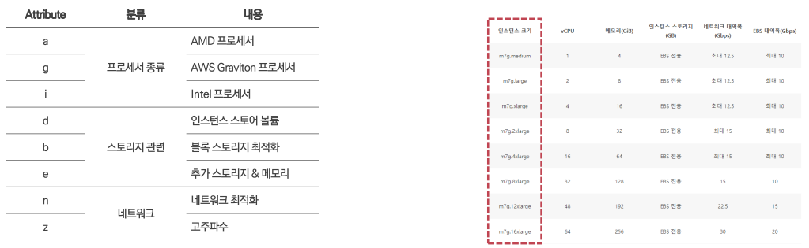
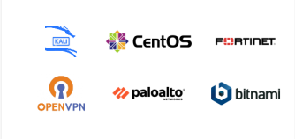

# Computing Service

## Elastic Compute Cloud

### Virtual Server Structure

- IaaS의 가장 대표적인 서비스
- **가상화된 컴퓨팅 자원**(인스턴스)을 제공


<br/>

### EC2 Instance Type - Naming Rule

- Application 또는 서비스 요구사항에 적합한 컴퓨팅 리소스 성능 선택 가능
  - CPU, Memory, Process, …


<br/>

**[ Instance Family ]**

- 인스턴스는 유형마다 제공하는 컴퓨팅 성능과 기능에 차이가 있다.
- **기능 별로 그룹을 묶어 패밀리 단위**로 구분


<br/>

**[ Instance Generation ]**

- 주기적으로 최신 기술을 반영한 신규 인스턴스 세대 출시
- 이전 세대 인스턴스 대비 **비용이 낮아지거나 성능이 향상**
- 리전, 가용영역 별로 **지원되는 인스턴스 세대가 다름**
  - 신규 배포 리전의 경우, Stable version 인스턴스 세대 위주로 서비스 출시
  - 이전 인스턴스 세대 중 미지원 되는 인스턴스 세대가 있음
- 되도록이면 최신을 사용하기

<br/>

**[ Attributes & Size ]**

- **추가 지원되는 기능**에 따라 Attributes가 붙음
- 인스턴스의 Size의 따라 vCPU, Memory, Disk, Network 처리량 상이
- `nano < small < medium < large < xlarge <… <112xlarge` 까지 확장



<br/>

### Amazon Machine Image

- EC2 인스턴스를 실행하는데 필요한 **설정 정보를 모은 단위 (템플릿)**
- **리전 단위로 저장**
- 사용하려는 리전에 AMI가 없으면 **리전 간 복사** 진행
- AMI 데이터 자체는 **S3에 저장**되며 저장 비용 발생


<br/>

**[ AMI 구성 요소 3가지 ]**

- **루트 볼륨 템플릿** : 인스턴스 루트 볼륨에 사용되는 템플릿
  - 운영체제, 라이브러리 등 (Amazon Linux2, Ubuntu, Windows)
- **인스턴스 시작 설정 값** : 인스턴스 타입, 네트워크 설정, 스토리지 구성 등
- **AMI 권한 관리 정보**(Permission) : Public / Private

<br/>

**[ AMI를 활용하는 사례 ]**

- DevOps CI/CD 환경에서 **개발 환경이 사전 구성**된 AMI로 **테스트 환경 생성**
- **Auto Scaling**을 통해 동일한 설정을 가진 인스턴스를 복제 생성
- 사내 지정 **보안 소프트웨어가 사전 설치된 AMI** 이용 인스턴스 생성
- 인스턴스 장애 발생 상황에서 사전에 **백업한 인스턴스 AMI 이용 시스템 복원 종류**

<br/>

### **AMI 종류**

**[ AWS AMI (Quick Start AMI) ]**

- AWS가 **기본 제공**하는 이미지
- 자주 사용되는 운영체제 위주
- **정기적인 보안 업데이트** 제공


<br/>

**[ Marketplace AMI ]**

- **Third-party 벤더**가 생성한 이미지
- 보안 소프트웨어, DB 서버 등 용도로 사용
- **사용료**가 포함된 AMI도 존재



<br/>

**[ Community AMI ]**

- **AWS 사용자**가 생성한 이미지를 공유한 것
- AMI의 **Permission을 Public**으로 설정한 것
- **사용 전 보안과 안정성 검토 필수**


<br/>

**[ Sharing AMI ]**

- **특정 사용자 간**에 공유하는 이미지
- 명시적으로 **허가된 계정**만 사용 가능
- 조직 내 **협업, 특정 프로젝트**에서 사용 가능


<br/>

### Public IP vs Elastic IP

**[ Public IP ]**

- EC2를 Public Subnet에 생성할 때 **자동 할당 되는 IP**
  - _Subnet 옵션 중 Auto-assign Public IP 설정 활성화 필요_
- **비영구적인 IP**로 인스턴스 중지 후 **다시 시작하면 새로운 값으로 변경**
- ~~비용이 청구되지 않는 무과금 IP 리소스~~ → 유료로 변경
- 임시로 EC2 인스턴스에 접근이 필요한 경우 사용
- IP 주소 고정이 필요 없는 환경에 적합

<br/>

**[ Elastic IP ]**

- 사용자가 **명시적으로 생성 후 EC2에 직접 할당**하여 사용하는 IP
- **영구적인 IP**로 인스턴스 중지 후 다시 시작해도 같은 값을 유지
- ~~조건부 무료로 제공되는 IP 리소스~~ → 유료로 변경
- IP를 고정하고 계속 사용할 필요가 있는 경우 사용

<br/>

### User Data

- EC2 인스턴스 시작 시 **초기 설정을 자동화**하기 위해 제공하는 **스크립트(명령어)**
- EC2 인스턴스가 **최초 생성되는 첫 부팅 시 한 번만 실행**
- 스크립트는 운영체제에 따라 형식이 다르며, 기본적으로 root 권한으로 실행
  > Linux / Unix : Bash Script  
  >  Windows : Power Shell Script
- User Data Script 실행 관련 로그는 /var/log/cloud-init-output.log 에 기록
- 최대 길이는 16KB까지 지원 (초과 시 Cloudinit 미작동)


<br/>

### [실습] Computing Service 구성하기

💡 **과정**

```
1. Bastion 서버 생성
2. Web 서버 생성 및 서비스 구성
		- Web 서버 생성
		- [Jumphost 방식] Bastion 서버 접속 → Web 서버 접속
		- [Shell Script 실행] 서버 환경 구성 및 Application 구성
3. Web IDE 서버 생성 및 개발 환경 구성
		- User Data 이용 Web IDE 환경(VS Code)을 EC2에 구성
		- Elastic IP 생성 및 VS Code 서버에 할당
		- 개발 환경 구성 (Code 다운로드, 필수 라이브러리 설치 등)
```


<br/>

## Elastic Load Balancer

- 클라이언트의 서비스 요청 **트래픽을 여러 서버로 분산**시켜 주는 서비스
  - 부하로 인한 **서비스 중단, 성능 저하 방지**
- **완전 관리형 서비스**
  - 트래픽 요청이 많을 경우 ELB 시스템도 내부적으로 **자동으로 확장**
  - 시스템에 대한 업그레이드, 가용성, 관리 등은 **AWS에서 지원**
- 다른 AWS 서비스와 연계 지원
  - **AWS ACM 인증서**와 연동하여 HTTPS 암호화 통신 지원
  - EC2, Auto-Scaling, Lambda, ECS, EKS 등 **컴퓨팅 서비스와 연계 사용** 가능
  - Route 53, Global Accelerator, CloudFront 와 통합해 Global 수준 확장, 최적화 제공


<br/>

**[ Elastic Load Balancer의 구성 및 트래픽 처리 방식 ]**

- **EC2를 Target Group에 할당** → ELB에 Target Group 연동하여 구성
- Target Group에서 **상태 검사**를 통해 **정상적인 서버에만 요청** 전달
- 수 십대의 서버가 구성되어 있어도 클라이언트는 **단일 Web Service Endpoint로 접근**

<br/>

### 구성 요소

**[ 리스너 (Listener) ]**

- **클라이언트 요청 수신** : Protocol, Port를 기준으로 **클라이언트의 요청 수신**
- **요청 검사 및 분배** : 요청 내용 검사 후 결과에 따라 **적절한 Target Group으로 전달**
- **구성** : **최소 1개 이상**의 리스너가 필요하고, **최대 10개**까지 설정 가능
- **SSL 인증서 지원** : SSL 인증서로 **HTTPS를 적용 가능**

<br/>

**[ 규칙 (Rule) ]**

- **구성요소** : 우선순위(Priority), 조건(Condition), 동작(Action)으로 구성
- **요청 검사 및 라우팅** : 요청 검사 과정에서 설정된 **조건에 따라 지정된 동작 수행**

<br/>

**[ 대상 그룹 (Target Group) ]**

- **부하 분산 대상 서버 모임** : EC2, Lambda, IP Address 등으로 구성
- **상태검사 (Health Check)** : 서버의 Health Check를 통해 서버 상태 모니터링


<br/>

### 종류

**[ Application Load Balancer ]**

- `Application Layer (L7)`
- HTTP, HTTP/2, HTTPS, WebSocket 지원
- **Contents-Based Routing**
  - Host, URL, Header, Methods, Query String, Source IP …
- SSL Offload 기능 제공
- Public IP를 사용하며, **DNS Name** 제공
  - Elastic IP 적용 불가


<br/>

**[ Network Load Balancer ]**

- `Transport Layer (L4)`
- TCP, UDP, TLS 지원
- 초당 수백만 건 요청 처리 (대용량 트래픽 처리용)
- **Elastic IP 적용 가능**
- SSL Offload 기능 제공
- 장기 세션 연결 유지 지원


> **💡 NLB의 성능이 좋은 이유**
>
> NLB는 L4 까지만 보고 나머지는 뒤로 넘기기 때문에 속도가 빠르고 성능이 좋다.
>
> NLB는 S-NAT을 하지 않는다. ALB는 수신과 응답을 모두 담당하는데, NLB는 수신만 하고 응답은 담당하지 않는다. ⇒ 성능 좋아짐
>
> client (1.1.1.1) → NLB → target group → nat gateway → client
>
> S-NAT을 사용하지 않기 때문에 target group은 1.1.1.1로 받게 된다.
>
> 다시 tg에서 응답을 보낼 때에는 NLB를 거치지 않고 nat gateway를 통해 client와 통신이 된다.

<br/>

**[ Gateway Load Balancer ]**

- `Network / Transport Layer (L3/L4)`
- **네트워크 트래픽에 특화**된 로드 밸런서
- **Third-party Network Virtual Appliance 연계** 지원
  - Firewall, IDS/IPS, DPI 같은 보안/모니터링 장비
- 비대칭 트래픽 처리 기능 제공
  - 패킷 검사를 위해 NVA에서 트래픽 처리 후 내부로 전달


<br/>

**[ Classic Load Balancer ]**

- `Transport / Application Layer (L4/L7)`
- HTTP, HTTPS, TCP, SSL 지원
- **EC2-Classic 환경**에서 사용하던 초기 모델
- ALB, NLB 대비 **제한적인 기능 제공**
  - Host Based 라우팅 제약, Port / Header 변경 제약
- SSL Offload 기능 제공
- Legacy 시스템 지원
- **_단종된 서비스로 미사용 권장_**

<br/>

### Health Check 기능 & 트래픽 분산 처리

- Target Group에 등록된 시스템을 대상으로 Health check
- **정상 응답 (상태코드: 200)을 받은 경우에만** 해당 시스템으로 트래픽 라우팅


<br/>

### [실습] Load Balancer Service 구성하기

💡 **과정**

```
1. Target Group 생성
2. Security Group 생성
3. Application Load Balancer 생성
4. 웹 브라우저에서 서비스 접속 테스트
```


<br/>

## Auto Scaling

> 증가하는 서비스 **트래픽에 맞춰 자동으로 서버의 수량을 조절**하는 기능

**[ Scale In & Out ]**

트래픽에 맞추어 **서버의 수량**을 늘리거나 줄이는 방식

**[ Scale Up & Down ]**

트래픽에 맞추어 **서버의 성능 스펙** (vCPU, Memory)을 향상 시키거나 낮추는 방식


<br/>

### 구성 요소

**[ Auto Scaling Group (ASG) ]**

- 관리 대상 **EC2 인스턴스**를 논리적으로 모아 놓은 집합
- **최소 크기, 최대 크기, 희망 용량**을 설정하고, 이 범위 내에서 인스턴스를 생성/제거
- 로드 밸런서의 특정 **Target Group으로 포함되도록 지정** 가능

<br/>

**[ Launch Template ]**

- Auto Scaling을 통해서 새로 **생성할 EC2 인스턴스의 설정 값** 모음
- AMI, Type, Security Group, Key-Pair, User Data 등을 정의
- **수정이 불가능**하고, 새로운 버전을 생성한 뒤 ASG 설정에서 버전 업데이트 필요

<br/>

**[ Scaling Policies ]**

- 인스턴스를 **조정하는 기준, 조건**을 설정하는 요소
- Scheduled, Dynamic, Predictive Scaling 방식 지원


<br/>

### 동작 과정

1. **ALB** 에서 EC2 **상태 검사** 수행
2. **Unhealthy 상태** EC2가 발견되면 **ASG로 전달**
3. **Launch Template** 트리거
4. EC2 생성 및 **ASG, Target Group**에 등록
   - _여기서는 Auto Scaling Policy와 별개로 동작_
5. 인스턴스 **Metric 수집 → CloudWatch**로 전달
6. Scaling Policy 조건 충족 시 **Alarm**
7. **Launch Template** 트리거
8. EC2 생성 및 **ASG, Target Group**에 등록


<br/>

### [실습] Auto Scaling 설정 및 Scale-Out 테스트

💡 **과정**

```
1. Web Server AMI 생성
2. Launch Template 생성
3. Auto Scaling Group 생성
4. Web Service 접속
5. Scale Out 실습
```


