# Storage Service

## AWS Storage Service Porfolio

- AWS Storage 관련 서비스를 저장, 보호, 전송 세 가지의 포트폴리오로 구분

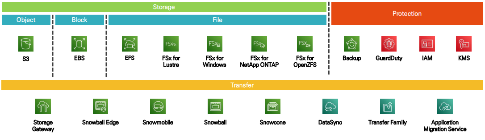

<br/>

### 종류

**[ Block Storage - Amazon EBS ]**

- 데이터를 일정한 크기의 **블록 단위**로 저장
- 블록의 **고유 주소**로 접근하여 **빠른 접근** 가능
- **서로 다른 OS**에서 접근 가능

<br/>

**[ File Storage - Amazon EFS, Amazon FSx ]**

- **파일과 폴더의 계층 구조**로 저장
- 파일, 폴더가 많아질 수록 **파일 탐색 성능 저하**
- **NAS** 시스템 (SMB, NFS Protocol)
- 파일시스템(프로토콜)에 따라 **OS 접근 제약**

<br/>

**[ Object Storage - Amazon S3 ]**

- **오브젝트 단위**로 데이터를 저장
- **Application 단**에서 동작
- 물리적 제약이 적어 **원하는 만큼 확장** 가능
- 오브젝트 별로 **키:값** 형태 구성

<br/>

## Elastic Block Store

- EC2 인스턴스에 연결해 사용할 수 있는 **네트워크 기반 Block Storage 서비스**
- 데이터 볼륨, 스냅샷에 대한 **암호화 지원**
- **하나의 인스턴스**에 연결하여 사용하며, EC2 인스턴스와 별개로 관리
  - 하나의 인스턴스에 **2개 이상의 EBS 볼륨 연결** 가능
  - Volume type io1,2 는 동일 가용영역의 **여러 인스턴스에 연결** 가능
  - 인스턴스에 연결되어 있던 EBS **분리 후 다른 인스턴스에 연결** 가능
- 특정 가용영역에서만 생성되기 때문에 **가용영역간 EBS 볼륨 공유 불가**
  - **스냅샷**을 이용해 **다른 가용영역으로 복제본**을 만들어 사용 가능
  - 가용영역 내에서 데이터를 자동으로 복제하여 99.999% 가용성 보장
- 디스크 용량을 희망하는 만큼 **프로비저닝**하여 사용

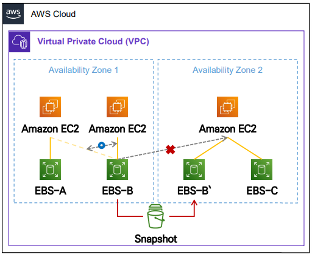

<br/>

### Volume Type

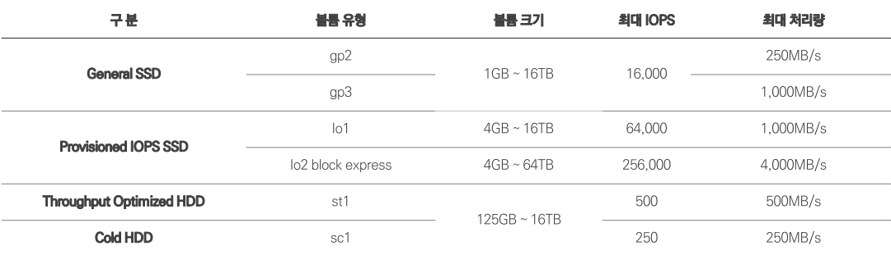

<br/>

### Instance Storage & EBS

**[ Instance Storage ]**

- 호스트 컴퓨터의 디스크를 **직접 연결**
- **가장 빠른 속도**의 디스크 타입
- **비영구적**인 저장소 (휘발성)
  - 인스턴스 중지/종료 시 하드웨어(호스트 컴퓨터)가 바뀌면서 **데이터 손실**
- 연결 해제 불가능
- 인스턴스 패밀리에 따라 디스크의 종류, 사이즈가 다름

<br/>

**[ EBS ]**

- EC2와 **네트워크로 연결**
- Instance Store 대비 **느림**
- **영구 보관** 가능한 저장소
- 연결 해제 후 다른 EC2 장착 가능

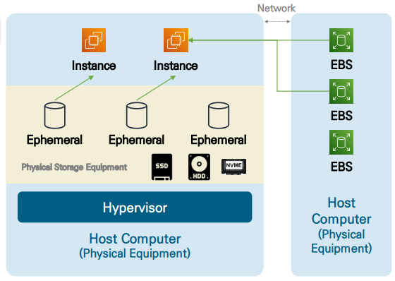

<br/>

### AWS EBS Snapshot

- **특정 시점**의 EBS 볼륨에 저장된 데이터를 **복사**해둔 데이터(백업 데이터)
- **증분 방식 저장**을 통해 저장 용량을 효율적으로 관리
  - 첫 스냅샷은 전체 데이터를 백업하고, 이후 스냅샷은 **추가된 데이터 블록**만 백업
  - 특정 스냅샷을 삭제하면 해당 데이터는 **이전 스냅샷과 병합**되어 관리
    - 병합 작업이 수행되어도 **데이터 복구에는 영향 없음**
- 스냅샷 데이터는 **S3 버킷**에 보관

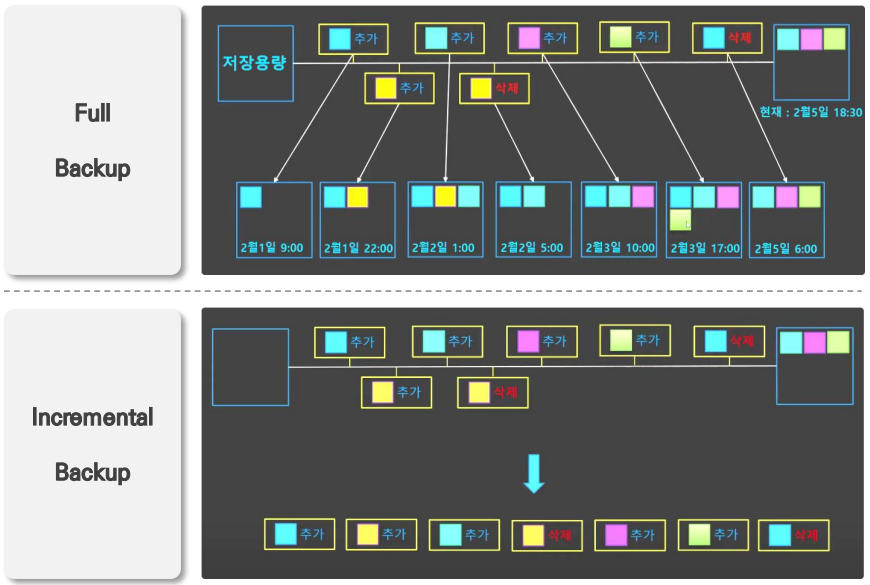

<br/>

**[ 활용 사례 ]**

- AMI와 같은 EC2 정보와는 별개로 **데이터만 백업**하고 싶은 경우
- 스냅샷을 통해 다양한 **AMI를 별개로 생성**하고 싶은 경우
- 암호화 되지 않은 EBS 볼륨을 **암호화 볼륨으로 교체**하고 싶은 경우
- **다른 가용영역**으로 볼륨을 복제하고 싶은 경우

<br/>

### AMI와 Snapshot 차이점

| 구분        | AMI (Amazon Machine Image)                                                         | Snapshot                                        |
| ----------- | ---------------------------------------------------------------------------------- | ----------------------------------------------- |
| 개념        | E2 인스턴스를 생성하기 위한 **템플릿**                                             | 특정 시점의 EBS 볼륨 데이터를 복제한 **백업본** |
| 목적        | EC2 인스턴스를 생성, 배포하는데 사용                                               | EBS 볼륨 백업 및 복구에 활용                    |
| 구성요소    | - EBS 볼륨 <br/> - **메타 데이터**(OS, 네트워크 설정 등)                           | - EBS 볼륨                                      |
| 저장 위치   | S3에 저장 <br/> (**백그라운드에서 관리되기 때문에 사용자가 직접 접근 제한**)       | S3 저장되며 **Snapshot ID**로 관리              |
| 포함 데이터 | - EC2 인스턴스에 부착된 **모든 EBS의 볼륨** <br/> - **OS, Application, 설정 정보** | - **특정 EBS 볼륨**                             |

<br/>

### [[실습] EBS 서비스 구성 실습](https://github.com/honi20/CloudWave/tree/main/AWS/99_Practice/05.%20Storage%20Service%20-%20EBS)

<br/>

💡 **실습 과정**

```
1. EBS 루트 볼륨 확장 실습
   - Web 서버 볼륨 확장
   - 파일 시스템 확장 및 볼륨 디스크 확인
2. EBS 볼륨 생성 실습
   - 추가 EBS 볼륨 생성 → Web 서버 할당
   - 파일 시스템 생성 → 마운트
3. 스냅샷 생성 실습
   - Web 서버 EBS 스냅샷 생성
   - 스냅샷 이용 볼륨 생성 (다른 가용영역에 할당) → VS Code 서버에 할당
   - 스냅샷 이용 해외 리전 볼륨 복제 실습
   - 수명 주기 관리자 이용 EBS 볼륨 스냅샷 생성 자동화 실습
```

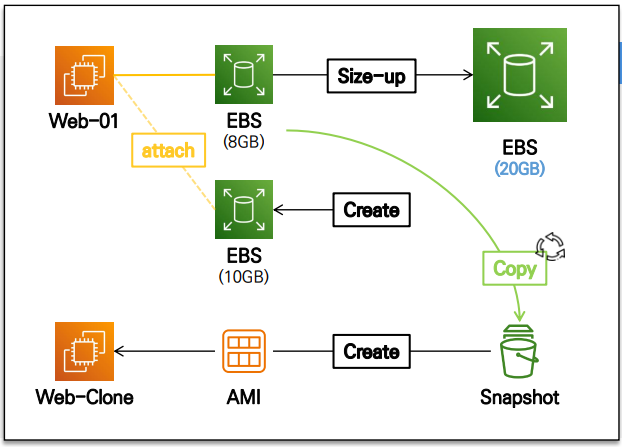

<br/>

## Simple Storage Service

### AWS S3

- 웹 서비스를 이용해 **어디서나 접근** 가능한 오브젝트 스토리지
- 용량 제한 없이 거의 **무제한 확장** 가능한 스토리지
- 용량을 사전에 프로비저닝 하지 않고 **사용한 만큼 과금**
  - 저장한 용량 만큼 비용 청구
  - 데이터 업로드, 다운로드, 요청 등 전송량에 따른 비용 청구
- 웹 브라우저의 **GUI를 이용하거나 REST API를 이용**해 데이터 관리
- 단순 데이터 저장소로 동작하며, **프로그램 설치 작업은 제한**됨
- **99.999999999%**의 가용성과 내구성이 강한 저장소
- 세부적인 접근 권한 관리 지원
  - Bucket Policy 이용 사용 주체, 데이터 별 권한 할당
  - IAM Policy 이용 사용 주체 별 접근 가능한 버킷의 데이터, 권한 할당
- **Static Web Hosting** 지원

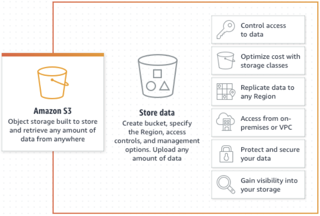

<br/>

### AWS S3 Bucket & Object Structure (key-value structure)

- 버킷을 생성할 때는 전역(Global)에서 **고유한 이름**으로 생성해야 하며, 생성되는 **위치 지정 필요(Region)**
- 버킷 내 저장되는 객체(Object)마다 **키와 값(데이터의 Full Path)** 으로 맵핑
- 객체를 저장하게 되면 **S3 URI**(AWS 내부 작업용 식별자)**, Object URL**(HTTP 기반 외부 접속용 식별자) 정보 할당
  - `S3_URL = s3://{BucketName}/{ObjectKey}`
  - `Object_URL = https://{BucketName}.{Region}.amazonaws.com/{ObjectKey}`

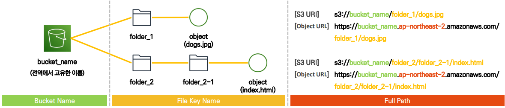

<br/>

### S3 보안 / 권한 (접근 제어)

| 구분      | Bucket Policy                                                                       | Access Control List                                                                                                                 | IAM                                                                                   | Pre-Signed URL                                                                           |
| --------- | ----------------------------------------------------------------------------------- | ----------------------------------------------------------------------------------------------------------------------------------- | ------------------------------------------------------------------------------------- | ---------------------------------------------------------------------------------------- |
| 개념      | - **JSON 형식**으로 작성된 **정책 문서** <br/> - Bucket에 **In-line 방식**으로 설정 | - **버킷** **객체 수준**의 개별 접근 권한 관리 <br/> - 특정 사용 사례에서 유용                                                      | - **보안 주체**에 직접 권한 할당 <br/> - **교차계정** 접근 시 반드시 필요             | - **제한 시간** 동안 접근 가능한 **링크** <br/> - 데이터를 **일시적으로 공유**할 때 사용 |
| 적용 범위 | 버킷 & 객체                                                                         | 객체                                                                                                                                | 보안주체                                                                              | 객체                                                                                     |
| 제어 수준 | - 세부적인 정책 설정 <br/> - **세밀한 조건 기반 정책** 설정                         | - 기본적인 **읽기, 쓰기, 나열** 설정                                                                                                | - 세부적인 정책 설정 <br/> - **세밀한 리소스 접근 권한** 설정                         | - **유효기간, 사용자** 지정 접근 설정                                                    |
| 사용 사례 | - 세부적인 권한 관리가 필요할 때                                                    | - 간단한 권한 설정 필요 시 <br/> (특정 AWS 계정에게만 권한 부여시) <br/> - 읽기 설정만 빠르게 구현할 때 <br/> - **권장하지 않음!!** | - 보안주체 별 세부적인 리소스 접근 권한 관리가 필요할 때 <br/> - **교차계정** 접근 시 | - **외부 사용자**에게 임시 접근 정보 전달                                                |

> 인라인 정책 : IAM 사용자 삭제 시 삭제됨

<br/>

**S3 Access Control List**

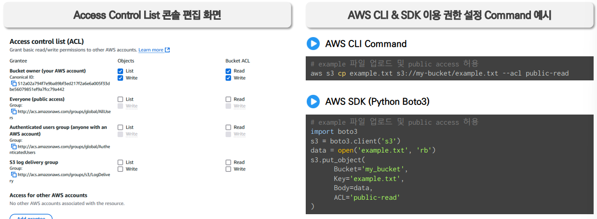

<br/>

**S3 Bucket Policy**

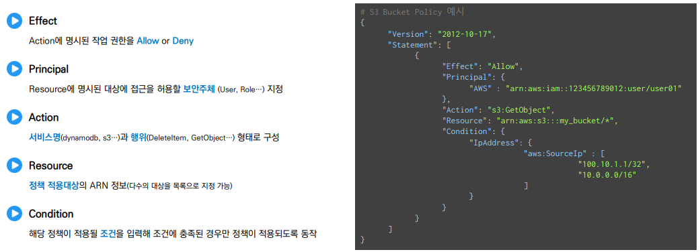

<br/>

**S3 Pre-Signed URL**

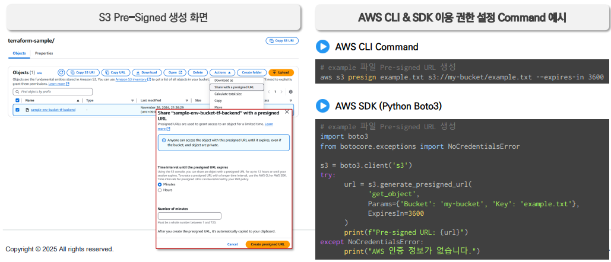

<br/>

### S3 Public Access Block

- Bucket Policy, S3 Access Control List 설정 보다 **Public Access Block이 우선**
- 기본적으로 버킷은 Private 상태로 생성되지만, 데이터를 안전하게 보호하기 위해 **Public 접근 허용 정책이 적용되는 것을 방지**하기 위한 도구
  - **Bucket Policy, Access Control List (ACL) 등에서 Public 접근 권한을 허용하는 설정을 무시하거나 차단**

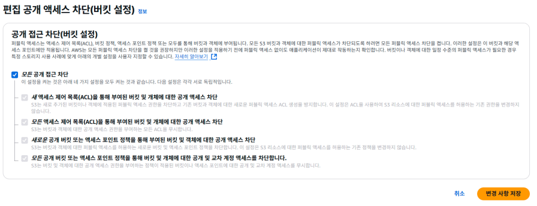

<br/>

### [[실습] S3 객체 업로드 & 접근제어 실습](https://github.com/honi20/CloudWave/tree/main/AWS/99_Practice/06.%20Storage%20Service%20-%20S3)

💡 **과정**

```
1. AWS Console 환경에서 버킷 생성 및 샘플 데이터 업로드
2. Object URL 정보 이용 접속 테스트
   - 웹 브라우저 이용 Object URL 접속
   - Public Access Block 설정 해제 → ACL 정책 설정 → 접속 테스트
   - 테스트용 버킷 삭제
3. AWS CLI 이용 버킷 생성 및 데이터 업로드
   - VS Code 서버 접속 → AWS CLI 이용 버킷 생성 → 샘플 데이터 업로드
   - 콘솔에서 업로드 데이터 확인 → Object URL 접속 테스트
   - Pre-Signed URL 생성 → 접속 테스트
   - Bucket Policy 설정 → 접속 테스트
```

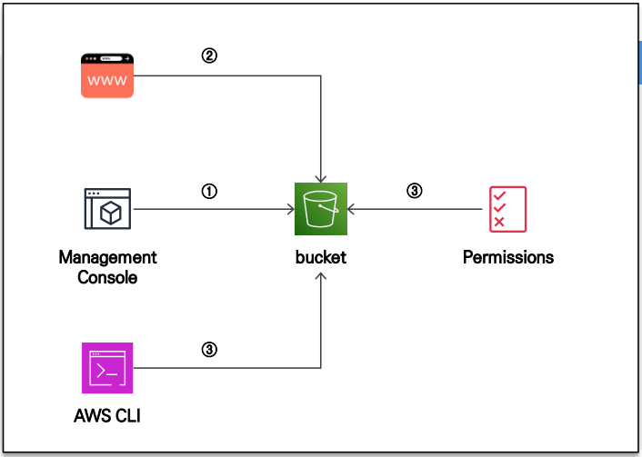
