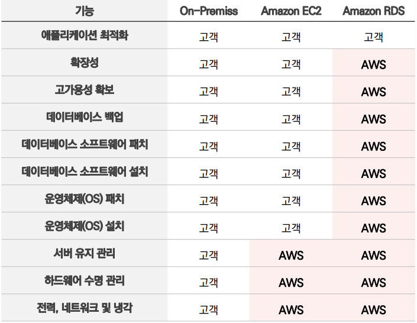
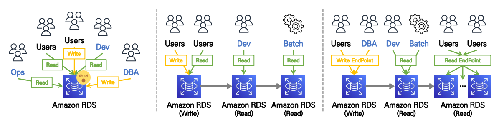
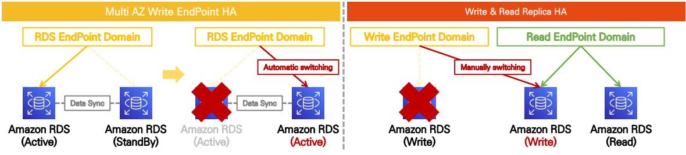
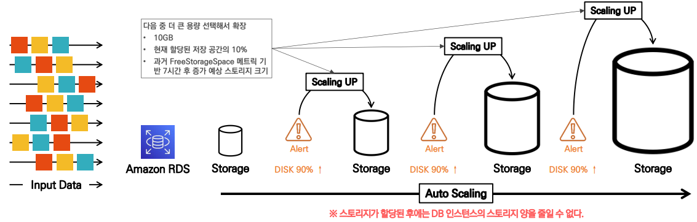
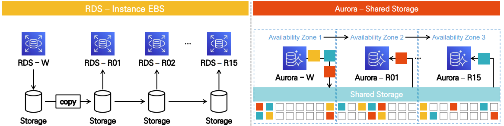
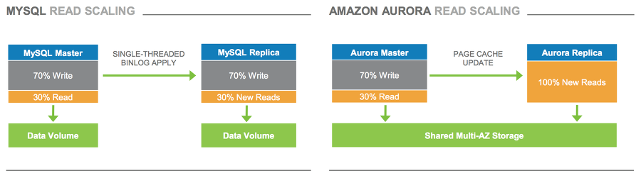
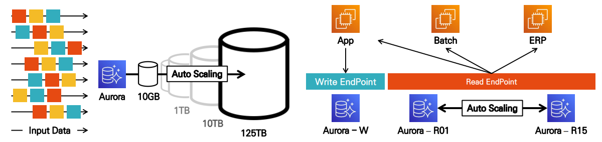
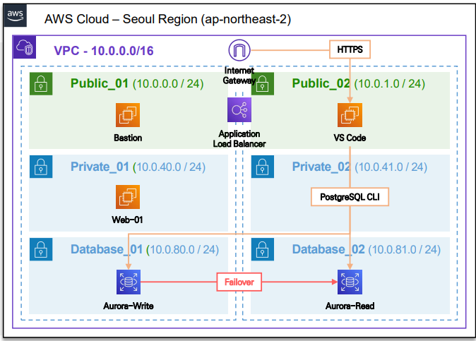

# Relational Database Service

### AWS RDS 개요

- **관계형 데이터베이스(RDBMS)를 완전관리형**으로 제공하는 서비스
- **하드웨어 프로비저닝, OS & DB 설치 및 패치, 백업** 등 운영 관리 지원
- RDS 서버 시스템 **직접 접속 불가능(SSH Terminal 접속 미지원)**
    - 접속해서 작업해야 하는 OS 패치, DB 설치 등의 작업은 AWS가 지원
    - 데이터베이스의 **파라미터 값 튜닝을 위한 Parameter Group** 설정 가능
- **장애 조치를 위한 다양한 기능**을 제공
    - 읽기 전용 복제본, 고가용성 옵션 등
- VPC 내부에 배치해서 사용하며 **VPC 환경을 이용한 보안 환경 구성** 외에도 **IAM, Secret Manager** 등의 서비스를 통해 데이터베이스 보안 강화 가능
- EC2와 같이 DB가 설치되는 **인스턴스의 Class(Type) 지정 가능**
    
    > 범용 타입 : db.m*  
        메모리 최적화 타입 : db.r*, db.x*, db.z*  
        컴퓨팅 최적화 타입 : db.c*  
        성능 버스트 타입 : db.t*
    > 



<br/>

### DBMS Engine Type

| DB | 특징 |
| --- | --- |
| Amazon Aurora | • **AWS에서 개발**한 DBMS <br/> • **MySQL, PostgreSQL**과 호환, **3~5배 높은 성능** <br/> • **스토리지 자동 확장**(용량 프로비저닝 없이 생성) <br/> • Multi AZ **고가용성** 제공 <br/> • **글로벌 데이터 동기화** 지원|
| MySQL | • 세계적으로 많이 사용되는 **오픈소스 DBMS** <br/> • 다양한 언어, 플랫폼과 호환 |
| MariaDB | • **MySQL을 포크**로 복제해서 만들어진 오픈소스 DBMS <br/> • MySQL 대비 강화된 DB Engine 및 고급 기능 (분산 트랜잭션) |
| PostgreSQL | • 다양한 **고급 기능** 지원 <br/> • **비정형 데이터**(Json, XML) 지원 <br/> • **사용자 정의 함수**, 트리거, 데이터 타입 지원 <br/> • 오픈소스 DBMS 중 기능, 성능 모두 뛰어난 제품 |
| Microsoft SQL | • **Window 생태계**와 뛰어난 호환성 지원 <br/> • Active Directory, .NET Framework 등 |
| Oracle | • DBMS의 대표 상용 제품 <br/> • **고성능 트랜잭션에 최적화** <br/> • RAC(Real Application Clusters)기능 이용 ⇒ **고가용성, 확장성** 제공 <br/> • 고성능 트랜잭션에 최적화 <br/> • **Partitioning Compression**과 같은 고급 데이터 관리 기능 제공|

<br/>

### Backup Service

**[ 자동 백업 – Automated Backup ]**

- **스냅샷과 트랜잭션 로그**를 참고해서 데이터를 백업하는 방식
- 자동 백업 기능은 **Default**로 활성화 됨
- Retention Period(1~35일) 기간 내 **특정 시점 데이터 상태로 복구(PITR) 가능**
    - 새로운 DB 인스턴스를 생성해서 스냅샷을 적용하는 방식으로 **엔드포인트 정보도 변경**
- **원본 DBMS가 삭제되면 함께 삭제**되는 데이터
- 백업 프로세스 시작 시
    - **단일 AZ 환경 - 일시적인 중단**
    - **다중 AZ 환경 - 무중단**

<br/>

**[ 수동 백업 - Snapshot ]**

- 사용자가 **수동으로 원하는 시점에 스냅샷을 생성**하는 방식
- 원본 DBMS가 삭제돼도 **스냅샷은 삭제 되지 않고 S3에 보관**
    - 백업 보존 기간이 없고, 사용자가 삭제 전까지 데이터 유지
- 백업 프로세스 시작 시
    - **단일 AZ 환경 - 몇 초에서 몇 분 정도 중단**
    - **다중 AZ 환경 - 일시적인 중단**
- 스냅샷은 **다른 리전으로 복제하거나 다른 계정에게 공유 가능**
    - 자동 백업에서도 교차 리전 자동 백업 기능 제공

<br/>

### Read Replica

- 대규모 서비스 트래픽을 분산처리하기 위해 데이터베이스 **읽기 작업만 지원하는 복제 데이터 베이스** ⇒ Select 명령만 사용
- **최대 15개의 읽기 전용 복제 본**을 리전, 가용영역에 걸쳐 구성 가능
- 읽기 전용 복제본은 원본 데이터베이스 시스템이 다운될 경우 **별도의 독립된 DB 인스턴스로 수동 승격 가능**
    - 다운타임: 수초 ~ 수분



<br/>

### Multi AZ

- Write 데이터 베이스 **Active-StandBy 형태 이중화 구성**으로 장애 대비 자동 복구 대응
- Read Replica의 쓰기 전용 데이터베이스 승격과 유사하지만 **다운타임 없음**
- **예비용 인스턴스를 하나 더 생성**해 두기 때문에 실제 서비스 되고 있지 않은 StandBy 시스템이지만 **기존대비 비용이 2배로 증가**
- Multi AZ를 구성하면 Read Replica처럼 성능 향상의 이점을 보지는 못함
- **고가용성**을 확보하기 위한 옵션



<br/>

### Storage Auto-Scaling

- 운영관리 과정에 디스크가 부족해지는 경우 **자동으로 용량을 확장**할 수 있도록 지원하는 기능
- 전체 용량 중 **여유 공간이 10% 미만인 상태가 5분간 지속**되고, 지난 **6시간 동안 저장소가 변경된 이력이 없을 경우** 자동으로 확장



<br/>

### Aurora vs RDS Storage Structure

- Aurora에 저장되는 데이터는 **최소 3개의 가용영역에서 데이터를 복제**하여 6개의 사본으로 저장
- **4/6 Quorum 방식**
    - 6개의 스토리지 노드 중 4개 이상의 노드에서 쓰기 작업이 성공해야 쓰기가 완료된다.
    - 3개 이상의 노드에서 읽기 작업이 성공해야 읽기가 완료된다.
- 내부에서 데이터 손실이 발생해도 **자체적으로 사본을 통해 자동으로 복구**





<br/>

### Aurora Storage & Read Replica Auto-Scaling

- 데이터의 저장공간은 **10GB부터 128TB까지 자동으로 사용하는 만큼 확장**
- 읽기 전용 복제본은 최대 15개까지 **Auto Scaling 설정 가능**
    - Writer Instance에는 적용 불가능



<br/>

### [[실습] Aurora PostgreSQL 서비스 구성 실습 과정](https://github.com/honi20/CloudWave/tree/main/AWS/99_Practice/07.%20Database%20Service%20-%20Aurora)

**💡과정**
```
1. Database Subnet 2개 생성
2. Aurora PostgreSQL DB 생성
3. PostgreSQL Terminal 접속 (VS Code → Aurora PostgreSQL 접속)
4. Database Parameter Group 생성 및 적용
5. Read Replicas 데이터 복제 테스트
    - Read Replicas 생성 → Write 인스턴스 접속 → Sample Data 삽입
    - Read Replicas 인스턴스 접속 → 복제 데이터 확인
6. Aurora Fail-over 테스트
7. 데이터 복구 실습
```
