# Management Service

## CloudFormation

- 인프라를 코드로 관리하게 해주는 서비스로, **AWS Resource의 생성, 관리, 업데이트를 자동화**한다.
- 코드를 **템플릿 형태**로 만들어서 관리하고, 템플릿을 통해 **STACK을 생성**하여 코드 내용을 기반으로 인프라를 생성한다.

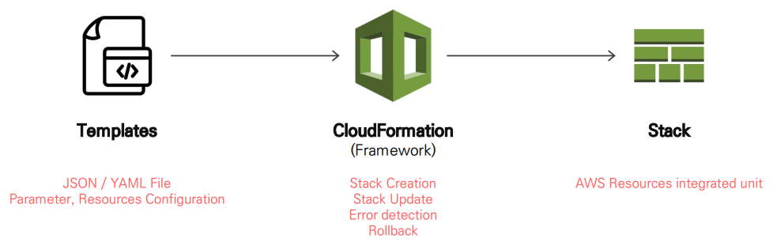

<br/>

**[ Cloud Native IaC Tools ]**

- CSP에서 제공하는 IaC 솔루션은 각 클라우드 시스템에 종속

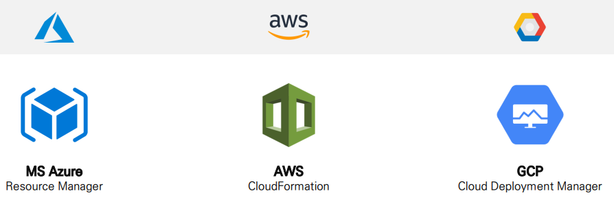

<br/>

### Templates Structure

- AWS Service를 Code로 설명하는 TEXT FILE (JSON / YAML 형식)

| Template Section | Template Anatomy |
| --- | --- |
| AWSTemplateFormatVersion: | CloudFormation의 템플릿 버전 |
| Description: | Template을 설명하는 문자열 |
| Metadata: | Parameter의 그룹화하고 순서 정리하는 용도 |
| Parameters: | Template 내부에 전달하기 위한 Value |
| Mappings: | Parameter 값을 조건부로 지정하는 기능 |
| Resources: | **[필수] 생성할 Resource 지정** |
| Outputs: | Stack 생성 완료 후 구성된 리소스의 값 반환 |

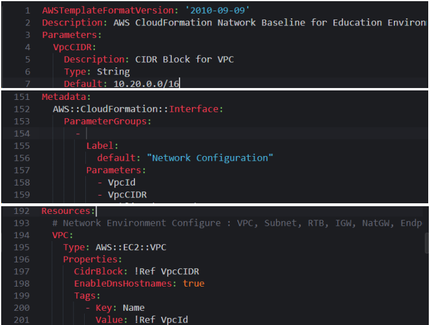

<br/>

### [[실습] IaC(CloudFormation)를 활용해 멀티 리전 환경 구성하기](https://github.com/honi20/CloudWave/tree/main/AWS/99_Practice/08.%20Management%20Service%20-%20CloudFormation)

**💡 과정**

```
1. [Console] 서울 리전 두 번째 Network baseline 생성
		- Resource Section 활용 VPC 생성
		- Parameter Section 활용 Subnet 생성
		- Output Section 활용 출력 값 생성
		- Metadata Section 활용 및 컴퓨팅 리소스 생성
2. [AWS CLI] 버지니아 리전 Network baseline 생성
		- 버지니아 리전 YAML Template 활용 Network Baseline 생성
3. [AWS CLI] 프랑크푸르트 리전 Network baseline 생성
		- 프랑크푸르트 리전 YAML Template 활용 Network Baseline 생성
```

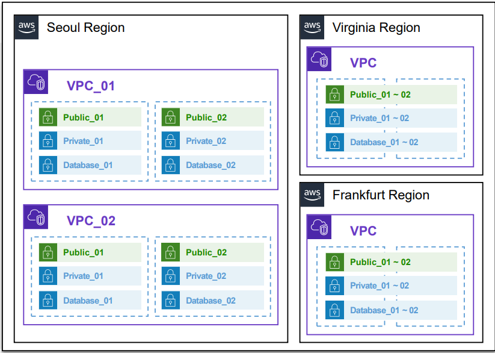

<br/>

## CloudWatch

- AWS Resource나 Application의 **모니터링 서비스**
- **운영 데이터(Log, Metrics, Event Data…) 수집, 분석, 시각화, 관리**를 위한 통합 서비스

<br/>

**[ 특징 ]**

- **Collect**
    - 대부분의 운영 데이터를 수집
    - CloudWatch Agent 이용
    - Custom Metric / Log 수집 가능
    
- **Monitoring**
    - CloudWatch Dashboard 이용
    - 수집된 데이터를 시각화
    
- **Act**
    - CloudWatch Alarm, EventBridge 이용
    - 임계치, 조건에 따라 특정 작업 트리거
    
- **Analyze**
    - CloudWatch Insights 이용
    - 로그 데이터 쿼리 / 분석

<br/>

**[ 주요 구성요소 ]**

1. **Metrics**
    - **AWS 리소스**에서 생성되는 **Metric 수집/저장**
    - **Custom Metric** 구성 및 수집/저장 가능
    - EC2 CPU 사용률, RDS DB Connection …
    
2. **Logs**
    - **AWS 리소스**에서 생성되는 **Log 수집/저장**
    - **Custom** 설정으로 **Application, System Log 추가** 수집/저장 가능
    
3. **Dashboards**
    - Metrics, Log **데이터 시각화**
    - **Multi Accounts, Multi Region** 데이터를 통합하여 한 곳에서 관리 가능
    
4. **Alarms**
    - Metrics 데이터를 기준으로 Alarms 설정
    - **임계치 초과 시 Email, Slack** 등으로 알림 전송
    
5. **CloudWatch Events**
    - **이벤트를 수집**하고 특정 리소스로 **라우팅**
    - 기타 서비스와 연동하여 **특정 작업 자동 수행**

<br/>

### CloudWatch Metrics

- AWS 리소스와 관련해서 **언제, 어떤 항목의 값이 무엇**이었는지 기록한 데이터
- CloudWatch에서는 AWS에서 제공하는 **거의 모든 리소스에 대한 지표(Metric)를 기본으로 제공**
- Custom Metric 구성 가능

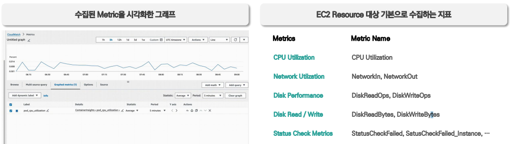

<br/>

**[ 주요 구성 요소 ]**

1. **Namespace**
    - 수집되는 **Metric을 Source 별로 그룹화** 하기 위한 구성 요소
    - AWS Service 마다 고유의 Namespace로 구성
        - `AWS/EC2`, `AWS/RDS`, `AWS/Lambda`
    - Custom Metric 구성 시에도 특정 Namespace 지정 필요
        - `Custom/MyApplicaionMetrics`
    
2. **Dimension**
    - **Metric을 더 세분화**하여 분류하기 쉽게 만들어주는 구성 요소
    - 키/값 구성으로 **최대 10개**까지 등록 가능
    - 동일한 Metric Name으로 구성된 값이라도 **Dimension으로 서로 다른 데이터로 구분**하여 분류 가능
        - 인스턴스별 CPU: `Key=InstanceId, Value=i-0123456789abcdef0`
        - ASG 인스턴스 CPU: `Key=AutoScalingGroupName, Value=lab-edu-asg`
    
3. **Metric Name**
    - 모니터링 하려는 Metric의 이름
    - **Namespace 내에서 고유**해야 함
    - AWS에서 제공하는 Metric 이름은 서비스 별로 사전 정의되어 있음
        - CPUUtilization, DiskReadOps, NumberObjects …
    - Custom Metric도 이름 지정 필요
    
4. **Period**
    - Metric 데이터를 **수집하는 시간 간격**
    - 기본 값은 1분(60초) 간격으로 수집
    - 일부 서비스는 1초 간격 수집 가능
    - Period 별 데이터 보존 기간
        
        > 60초 미만 데이터: 3시간   
        60초 데이터: 15일   
        300초 데이터: 63일   
        3600초 데이터: 455일(15개월)
        > 

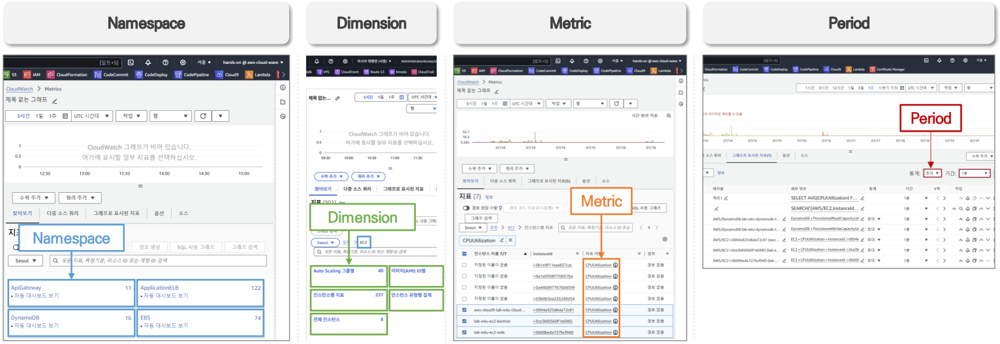

<br/>

### CloudWatch Logs

- AWS 리소스 및 시스템, 애플리케이션의 **로그 데이터를 수집, 모니터링, 저장, 분석**하는 관리형 서비스
- **Standard, Infrequent Access** 두 개의 Class 지원

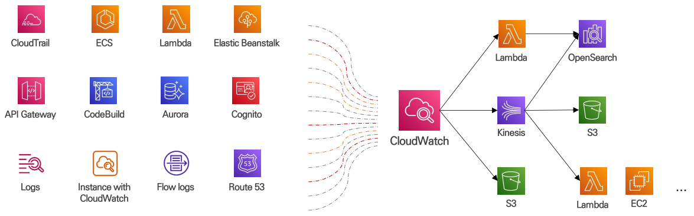

<br/>

**[ 주요 구성요소 ]**

1. **Log Event**
    - 로그 데이터의 **기본 단위**
    - 모니터링 중인 애플리케이션, 리소스 활동에 대해 **기록한 레코드**
    - 레코드에는 **Timestamp, Messages**로 구성
    
2. **Log Stream**
    - 로그 이벤트를 **시간순으로 모아둔 단위**
    - 모니터링 중인 애플리케이션, 리소스에서 나온 **이벤트의 시퀀스를 표시**하는데 사용
    
3. **Log Group**
    - **관련된 로그 스트림을 그룹화**한 논리적인 단위
    - 로그 스트림 **개수 제약 없이 그룹화** 가능
    - **보존 기간, 접근 제어** 설정 단위
    
4. **Retention Period**
    - 로그 이벤트 **보관 기간을 설정**하는 데 사용
    - **기간 만료**된 로그 이벤트는 자동으로 삭제
    
5. **Metrics Filter**
    - 수집된 로그 데이터를 **분석해 특정 패턴, 이벤트를 감지**하여 CloudWatch **Metrics로 전달**
    - 특정 문자열, 키워드, JSON 필드 필터링
    
6. **Subscription Filter**
    - **실시간으로 다른 서비스에 전송**하는 기능
    - OpenSearch, Lambda, Kinesis … 로 전송
    - OpenSearch로 로그를 검색, 분석, 시각화

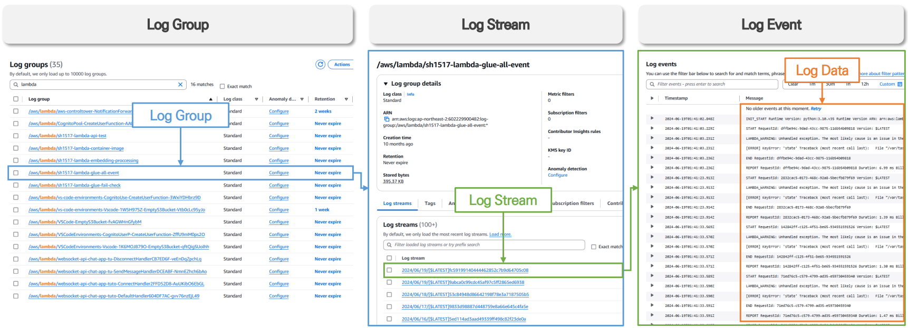

<br/>

### CloudWatch Alarm

- 모니터링 하는 Metric 데이터를 기반으로 특정 조건(임계값)을 설정해, 조건이 충족될 때 특정 작업을 트리거 하도록 구성할 수 있는 기능
- Alarm을 통해 특정 작업을 자동화 하도록 구성할 수 있음

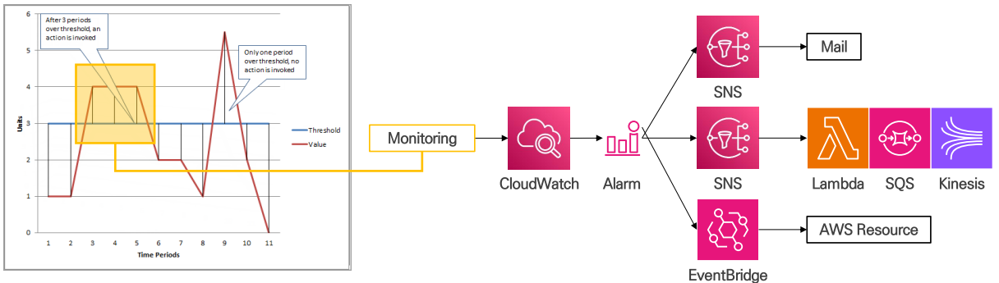

<br/>

### CloudWatch Dashboard

- AWS 리소스 및 애플리케이션에 대한 Metric, Alarm 등의 정보를 사용자 지정 화면을 설정해 모니터링에 활용할 수 있는 기능

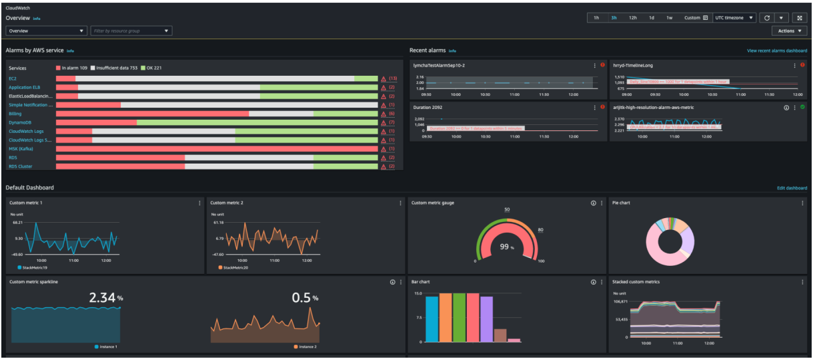

<br/>

### [[실습] CloudWatch & Agent 이용 리소스 모니터링 하기](https://github.com/honi20/CloudWave/tree/main/AWS/99_Practice/09.%20Management%20Service%20-%20CloudWatch)

**💡 과정**

```
1. CloudWatch Alarm 구성
2. CloudWatch Agent 설치 및 구성
3. Custom Metric 수집
4. Custom Logs 수집
5. Custom Dashboard 구성
```

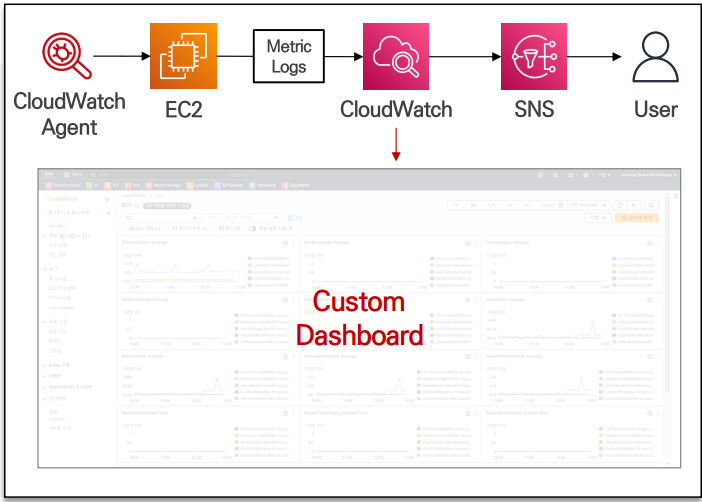