# Network Connectivity

## VPC Peering

- 서로 격리 되어 있는 **2개 이상의 VPC의 네트워크를 연결**하는 서비스
    - **동일 계정**에 구성된 서로 다른 VPC 연결 가능
    - **다른 계정**에 구성된 서로 다른 VPC 연결 가능
    - **서로 다른 리전**에 구성된 VPC 연결 가능
- VPC Peering 연결 리소스 비용은 **무료**
    - 동일 리전, 가용영역에서 발생시키는 데이터 트래픽은 무료
    - **리전, 가용영역을 교차하는 데이터 트래픽은 과금**
- VPC Peering 제약사항
    - **전이적 피어링 구성 불가능**
    - **CIDR Block이 겹치는 경우** **VPC Peering 구성 불가능**

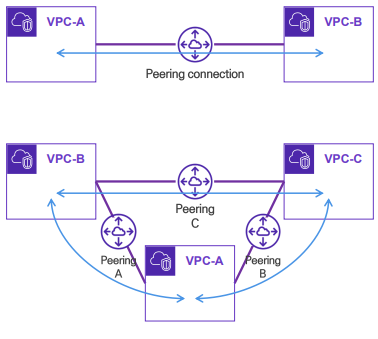

<br/>

### 연결 구성

**[ 같은 계정에 구성된 서로 다른 VPC의 연결 ]**

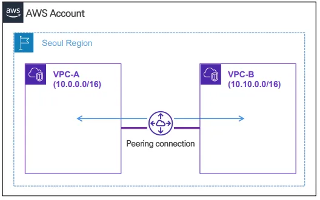

<br/>

**[ CIDR Block이 겹치는 경우 Peering 구성 제한 ]**

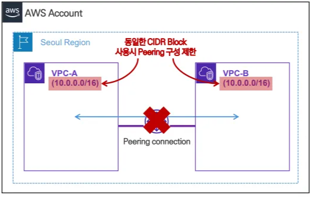

<br/>

**[ 같은 계정에서 서로 다른 리전에 구성된 VPC의 연결 ]**

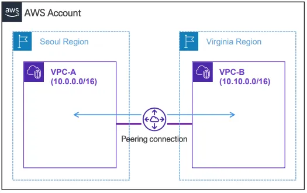

<br/>

**[ 다른 계정에 구성된 VPC 간의 연결 ]**

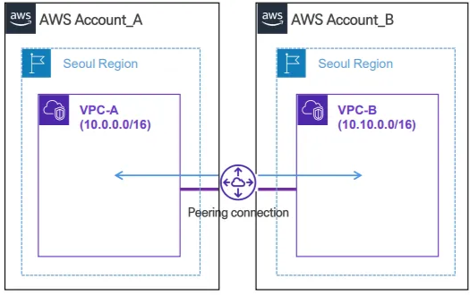

<br/>

### 제약 사항

**[ VPC Peering의 전이적 구성 제한 ]**

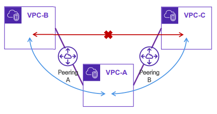

<br/>

**[ 상호 통신을 위해서는 모든 VPC가 서로 Peering 구성 필요 ]**

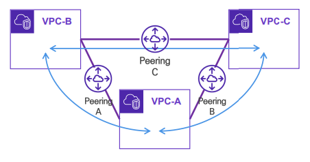

<br/>


### [[실습] VPC Peering 이용 VPC 연동](https://github.com/honi20/CloudWave/tree/main/AWS/99_Practice/10.%20Network%20Connectivity%20-%20VPC%20Peering)

💡 **과정**

```
1. 동일 리전 VPC Peering 연동
		- 서울 리전 1번 VPC, 2번 VPC Peering
		- 서울 리전 1번 VPC, 2번 VPC Network 통신 테스트
2. 멀티 Region VPC Peering 연동
		- 서울 리전 1번 VPC, 버지니아 리전 VPC Peering
		- 서울 리전 1번 VPC, 버지니아 리전 VPC Network 통신 테스트
3. 전이적 Peering 제약 테스트
		- 서울 리전 2번 VPC, 버지니아 리전 VPC 통신 테스트
```

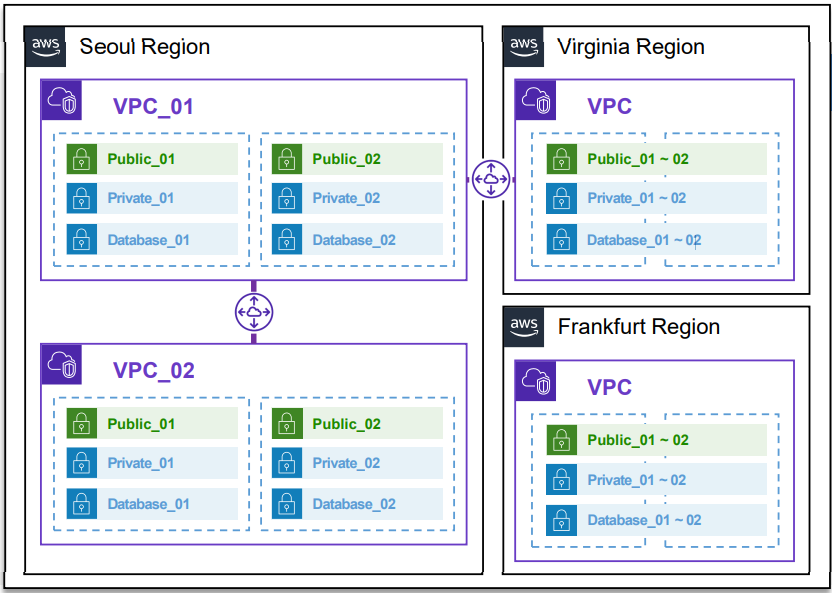

<br/>


## VPC Endpoint

- VPC 내부 리소스가 AWS Service(VPC 외부)에 접근할 때 **Private Link**를 사용해 **사설 통신**이 가능하게 해주는 서비스
- 기존에는 인터넷 게이트웨이 없이는 Public Internet 뿐만 아니라 S3, CloudWatch 등의 서비스에도 접근 불가능하다.
- Internet Gateway, NAT Gateway, VPN, Direct Connect를 사용하지 않고 사설 통신 구간을 이용해 AWS 서비스와 통신

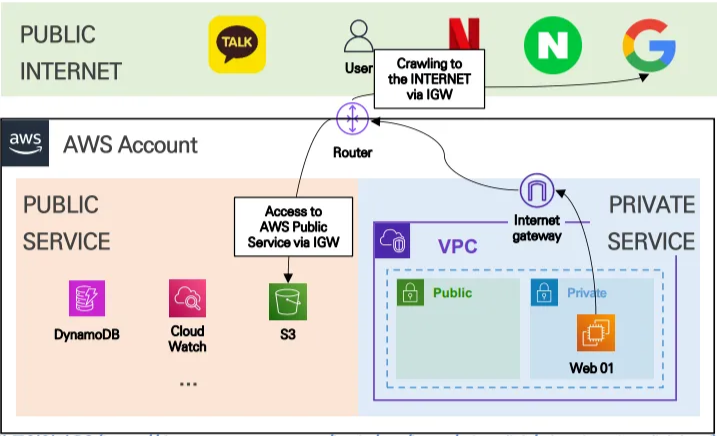

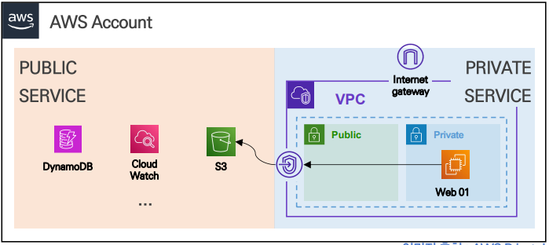

<br/>

### 종류

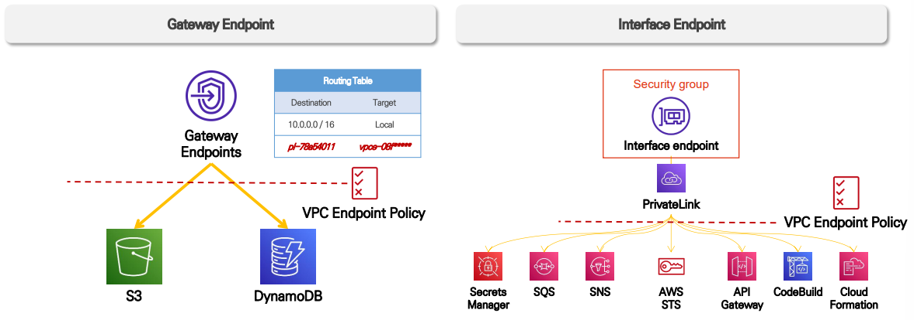


**[ Gateway Endpoint ]**

- **S3, DynamoDB 서비스**를 대상으로 Private 연결 제공
- **Routing Table**을 통해 연결
    - Gateway Endpoint를 생성하면 지정한 VPC Routing Table에 프라이빗 경로가 추가됨
- 추가 비용 없이 **무료로 사용 가능**

<br/>

**[ Interface Endpoint ]**

- **Private Link를 지원하는 서비스**를 대상으로 Private 연결 제공
    - AWS 서비스의 거의 대부분의 서비스가 Private Link 지원
- 지정한 **VPC 내부에 Elastic Network Interface(ENI)를 생성**하여 통신 지원
- ENI와 AWS 서비스와 연결하여 Private 통신 구간이 활성화 되는 구조
- 트래픽에 따른 **비용 발생**

<br/>

### [[실습] VPC Endpoint 이용 VPC 내부 리소스와 S3 사설 통신 구간 실습](https://github.com/honi20/CloudWave/tree/main/AWS/99_Practice/11.%20Network%20Connectivity%20-%20VPC%20Endpoint)

💡 **과정**

```
1. S3 Gateway Endpoint 생성 실습
		- Nat Gateway 경로가 없는 Private Subnet 02에 Endpoint 생성
		- Web 02번 서버를 이용해 AWS CLI로 S3 데이터 목록 조회
2. Interface Gateway 생성 실습
		- Nat Gateway 경로가 없는 Private Subnet 02에 Endpoint 생성
		- SSM Session Manager를 사용해 Web 02번 서버 접속 테스트
```

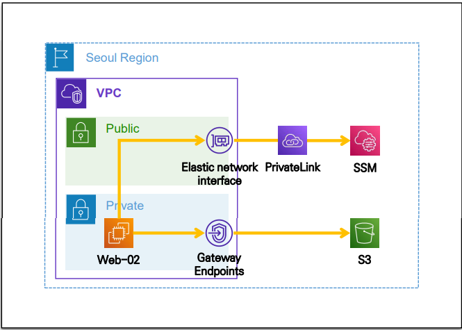

<br/>

## Route S3

- AWS에서 제공하는 **완전 관리형 DNS 서비스**
    - 도메인 구입 및 **Domain 호스팅 관리** 지원
    - **외부 도메인**을 AWS Route 53의 Hosted Zone에 등록하여 사용 가능
- DNS Routing Policy를 통해 트래픽을 적합한 Endpoint로 라우팅
- 도메인 및 연결된 리소스에 대한 **Health Check** 기능 제공
- AWS에서 **유일하게 100% SLA 제공** ⇒ 서비스 안전성 보장

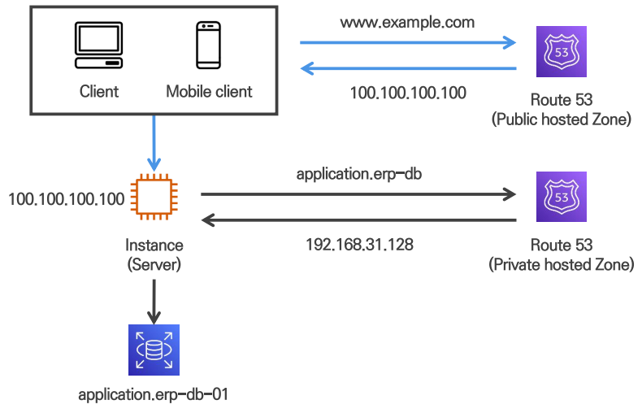

<br/>

### 호스팅 영역

**[ Public Hosted Zone ]**

- 인터넷에 연결된 **모든 리소스에 접근 가능**한 DNS 서비스 제공
- **인터넷에 연결된 리소스**의 DNS Record를 관리하는 저장소
- AWS 또는 외부에서 구매한 **도메인을 등록**하여 사용 가능
- 인터넷에서 도메인 이름을 통해 웹 사이트, API 등을 이용해 리소스 접근 가능

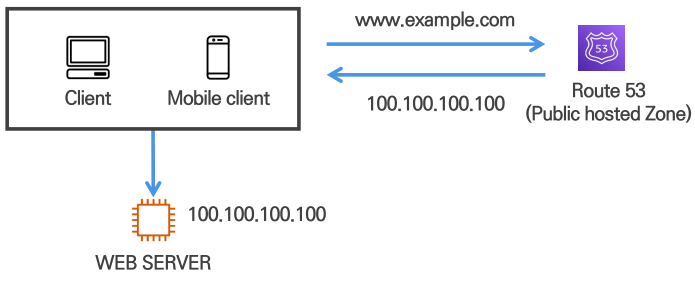

<br/>

**[ Private Hosted Zone ]**

- **특정 VPC 내부 리소스만 접근 가능한 Local DNS** 서비스 제공
- VPC 내부 리소스 간 통신을 위한 맞춤형 도메인 제공
- **VPC 내부 네트워크 리소스**의 DNS Record를 관리하는 저장소
- VPC **내부 통신**에만 사용됨 ⇒ **인터넷에서 접근 불가**
- **Private DNS 이름**을 사용해 **내부 애플리케이션 간 통신 최적화**

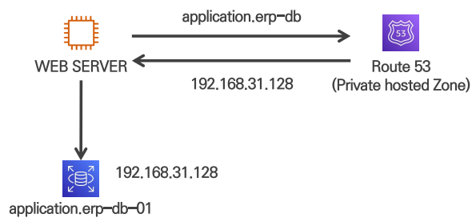

<br/>

### 지원되는 DNS Records Type

| Type | Description |
| --- | --- |
| A | • **도메인 주소와 IPv4 주소**를 직접 할당 <br/> • `www.example.com → 123.23.3.1` |
| AAAA | • **도메인 주소와 IPv6 주소**를 직접 할당 <br/> • `www.example.com → 2001:0db8:85a3:0:0:8a2e:0370:7334` |
| CNAME | • Canonical Name Record <br/> • **도메인 주소를 다른 도메인 주소**에 할당 <br/> • `www.sample.com → www.example.com` |
| MX | • Mail Exchanger (메일 서버 레코드) <br/> • **도메인 주소를 이메일 서버**에 할당 <br/> (등록 도메인 주소 정보를 이메일 주소로 사용) |
| NS | • Name Server <br/> • **구매한 도메인을 관리하는 네임 서버** 정보 <br/> • `example.com → ns-2048.awsdns-64.com / ns-2049.awsdns-64.com …` |
| SOA | • Start of Authority <br/> • **구입한 도메인에 대한 기본 정보**가 담긴 레코드 <br/> • OpenSearch로 로그를 검색, 분석, 시각화 |

<br/>

### Routing Policy

1. **Simple Policy**
    - **단순한 방식**으로 도메인에 대한 트래픽을 리소스로 전달하는 방식
    - 1개의 레코드에 **Multi Value** (2개 이상의 IP 주소) 설정 가능
        - Multi Value 값 설정 시 **다중 값을 반환**하고 **Client에서 1개를 선택**하여 사용
        - Alias (별칭) 레코드 값 적용한 경우 Multi Value 적용 제한
    - Health check 기능 사용 제한
    
    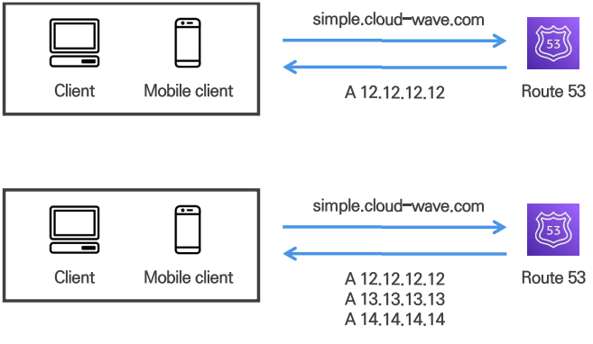
    
<br/>

2. **Weighted**
    - **단순한 방식**으로 도메인에 대한 트래픽을 리소스로 전달하는 방식
    - 도메인에 등록된 리소스 마다 **가중치를 적용**해 트래픽 양을 조절하는 방식
        - 레코드의 유형과 레코드의 이름을 동일하게 구성
        - 각 레코드에 가중치를 설정
        - 모든 레코드의 **가중치 값이 0**인 경우 **모든 레코드에 균등한 가중치** 적용
    - Health check 기능 사용 가능
    
    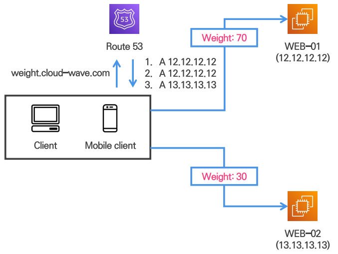

<br/>

3. **Latency**
    - **Latency (응답 지연시간)이 가장 적은 리소스**의 정보를 반환하는 방식
        - 일정 기간 측정된 결과 값을 기준으로 라우팅
        - 시간이 지남에 따라 최초 응답 받은 라우팅 값과 다른 값을 반환 받을 수 있음
    - 다중 리전 환경에서는 클라이언트와 **가장 근접한 리소스로 연결될 확률이 높음**
    - Private Hosted Zone에 등록된 레코드에도 적용 가능
    
    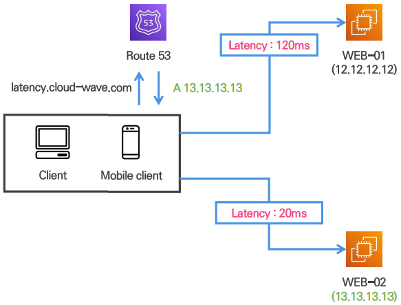

<br/>

4. **Failover**
    - Route 53에서 제공하는 상태 검사기를 이용해 **정상 리소스 값을 반환**하는 방식
    - **하나의 기본 레코드와 하나의 보조 레코드**로 구성
    
    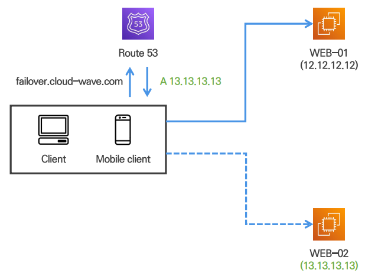

<br/>

5. **Geolocation**
    - Client의 **위치 정보를 기반으로 가장 가까운 리전의 리소스 정보를 반환**하는 방식
        - 위치 정보와 레코드 반환 값을 Mapping해 구성
        - 사용자 위치에 일치하는 레코드 정보가 없을 경우를 대비해 Default 레코드 생성 필요
    - **EDNS (RFC 7871) 기능**을 지원하지 않는 경우 예상과 다르게 동작할 수 있음
        - Geolocation 레코드는 DNS 서버의 IP 주소를 기반으로 동작
        - EDNS 기능을 지원할 경우 확장 헤더에 Client의 IP를 추가하여 전달
        - EDNS 기능 지원 DNS 서버
            
            > Google DNS server : 8.8.8.8, 8.8.8.4   
            Open DNS server: 208.67.222.222, 208.67.220.220   
            Amazon Route 53
            > 
    - 접속하는 사람이 어느 나라에 있냐에 따라 언어를 다르게 하고 싶을 때 사용
    
    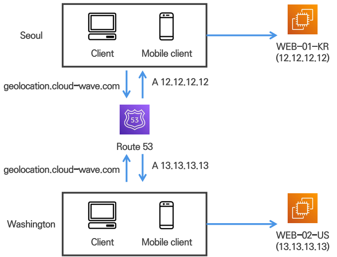

<br/>    

### [[실습] Route 53 도메인 등록 및 라우팅 정책 동작 과정 확인 실습](https://github.com/honi20/CloudWave/tree/main/AWS/99_Practice/12.%20Network%20Connectivity%20-%20Route%2053)

💡 **과정**

```
1. Route 53 도메인 등록 및 Record 설정 실습
2. Simple Routing Policy 실습을 통한 동작 방식 이해
3. Weighted Routing Policy 실습을 통한 동작 방식 이해
4. Latency Routing Policy 실습을 통한 동작 방식 이해
5. Failover Routing Policy 실습을 통한 동작 방식 이해
6. Geolocation Routing Policy 실습을 통한 동작 방식 이해
```

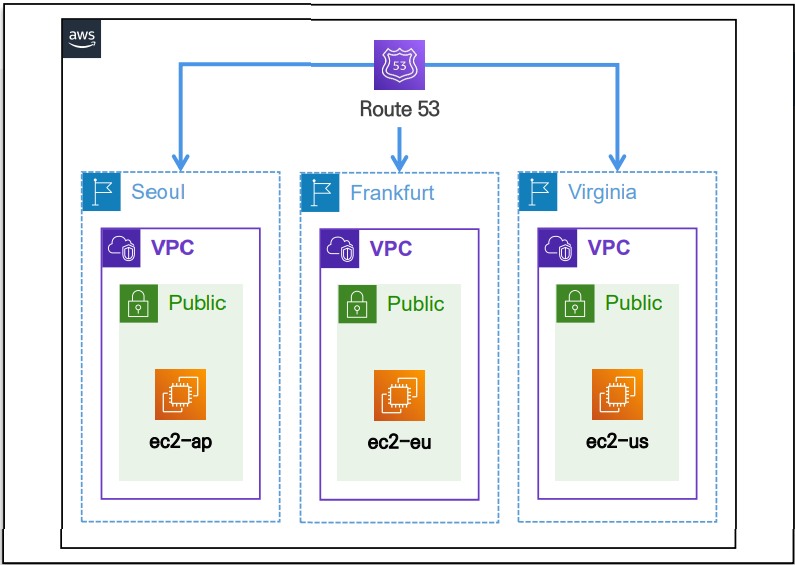