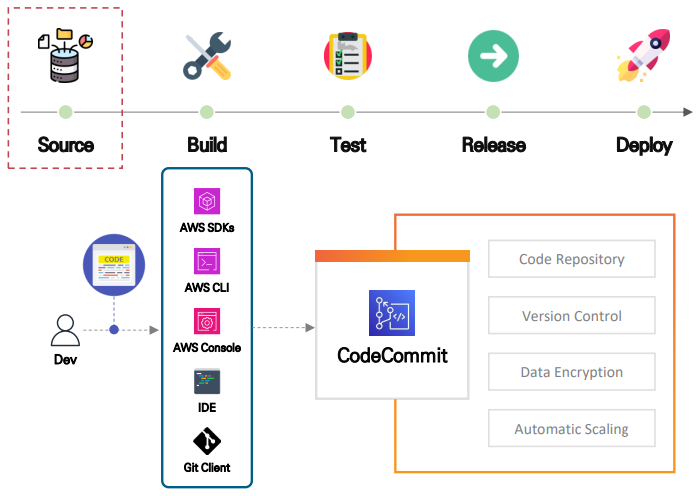
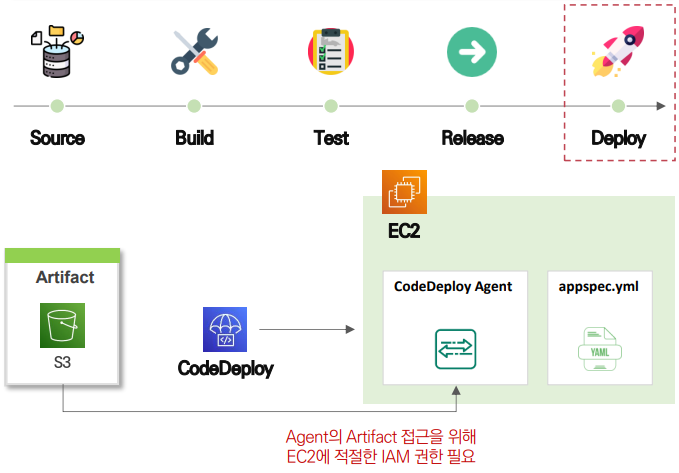

# Developer Tools

### **CodeCommit**

- AWS에서 제공했던 Private Git **Remote Repository**
- 다양한 **AWS 서비스와 연동 구성 가능**
    - IAM 권한을 통한 접근제어
    - EventBridge, Lamdba 이용 통계 분석
- **완전 관리형 서비스**로 관리 부담 최소화
- 최초 사용자 **5명까지 무료 사용 가능**
- **2024년 6월 6일 부터 서비스 종료**



<br/>

### Git & Github

**[ Git ]**

- **분산 버전 관리 시스템 (DVCS, Distributed Version Control System)**
- 소스 코드, 파일의 **변경 이력을 저장해 이전 상태 복구, 특정 시점 복구** 지원
- **로컬 저장소 / 원격 저장소로 구분**해 분산 시스템 구조로 동작
    - 로컬 저장소에도 전체 **프로젝트 히스토리 저장**
    - 네트워크 연결 없이도 작업 가능하고 **중앙 서버에 문제가 생겨도 복구 가능**

<br/>

**[ Github ]**

- Git을 기반으로 한 **원격 저장소 관리를 통해 개발자 협업 환경 제공**
- 버전 관리 데이터(Commit, Merge…)를 **시각화 기능 제공**
- Jira, Slack, AWS 등 다양한 **개발 툴 통합 지원**


<br/>

### AWS CodeBuild

- 완전 관리형 빌드 서비스
    - 빌드 환경이 세팅 된 컨테이너를 온디맨드 형태로 빌려 쓰는 방식
- 소스코드 Compile, Test, Packaging, Deploy 서비스 제공
- 배포 가능한 Artifact 형태의 데이터를 생성하여 S3에 저장
- buildspec.yml 파일에 정의된 명령에 맞춰 build 진행


<br/>

### AWS CodeDeploy

- EC2, ECS, Lambda, CloudFormation, On-Premises Server 등 다양한 컴퓨팅 자원에 배포를 자동화 해주는 완전 관리형 배포 서비스
- 다양한 배포 모드 (Blue/Green, In-Place) 제공
- 배포 중 실패할 경우 롤백 기능 지원
- EC2 인스턴스에 배포할 경우 CodeDeploy Agent 설치 필요
- appspec.yml에 실행할 script 파일 위치, 배포 대상 정의



<br/>

### AWS CodePipeline

- Build, Test, Release, Deploy 서비스를 자동화
    - 빌드/테스트를 마친 파일을 배포
- 다양한 배포 모드 제공
    - Blue/Green, In-Place, …
- 배포 중 실패할 경우 롤백 기능 지원


<br/>

### [[실습] GitHub, CodeDeploy, CodePipeline으로 간단한 CI/CD 환경 구성하기](https://github.com/honi20/CloudWave/tree/main/AWS/99_Practice/13.%20Dev%20Tools%20-%20CICD)

💡 **과정**

```
1. GitHub Repository 생성
    https://github.com/honi20/cloud-wave
		
2. CodeDeploy 생성
3. GitHub Actions 구성
4. 코드 배포 테스트
```

