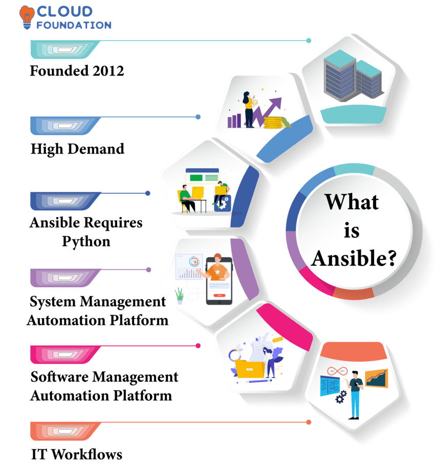
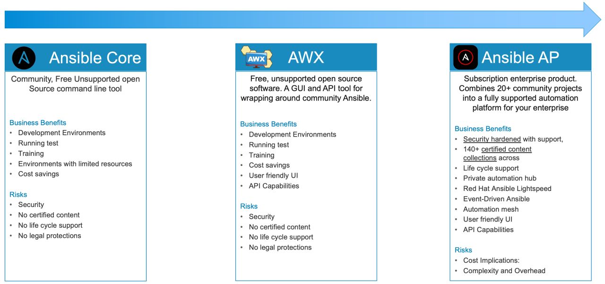
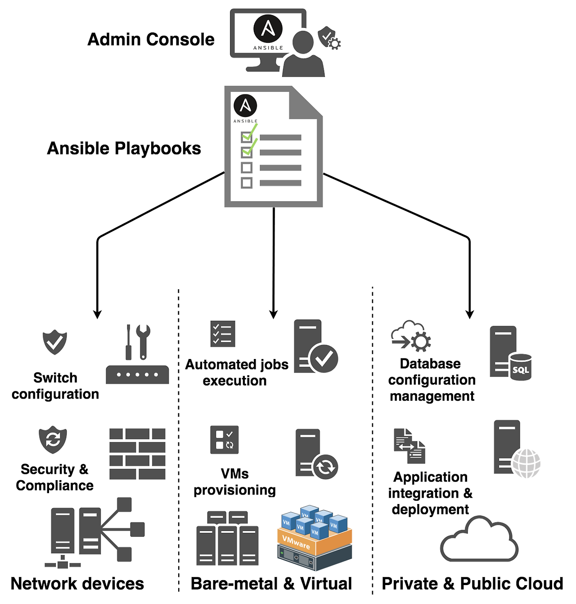
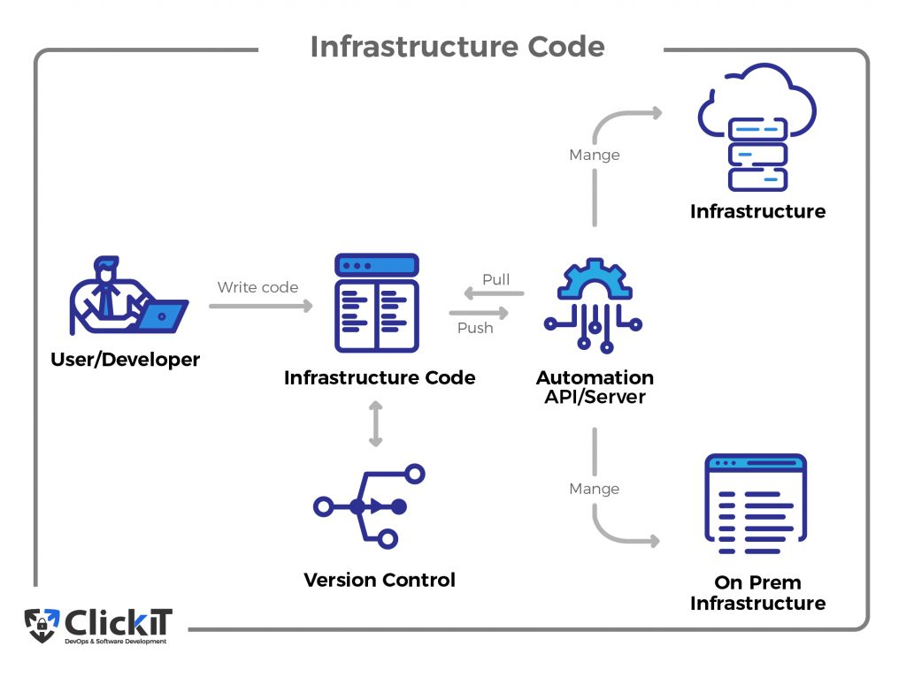
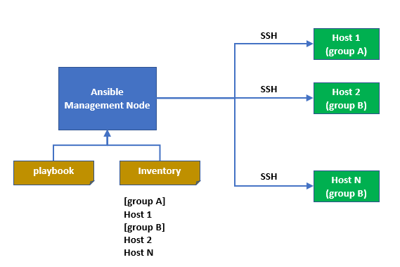
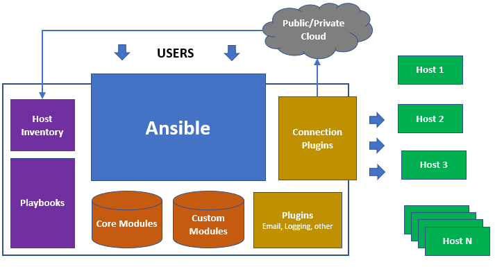

# Ansible 소개

## Ansible

- **오픈 소스 자동화 플랫폼**으로  **IT 시스템 구성 및 관리를 자동화**하는 강력한 도구
- 여러 서버에 동일한 설정을 반복적으로 적용하거나, 새로운 서버를 빠르게 설정하는 등의 반복적인 작업을 자동화하여 시간과 노력을 절약하고, 인적 실수를 줄여주는데 도움을 주는 도구

        수년 전까지 대부분의 시스템 관리 및 인프라 관리는 그래픽이나 명령줄 인터페이스를 통해 수행된 수동 작업을 통해 구성되어져 왔다. 시스템 관리자는 표준 작업을 수행하기 위해 체크리스트를 만들고 관리 가이드 및 임기응변이나 축척된 경험들을 통해 시스템을 관리해 왔다.

        하지만 이런 방식은 다양한 문제가 발생시킨다. 
        1) 시스템 관리자가 단계를 건너뛰거나 작업을 할 때 실수하기가 쉽다. 
        2) 또한 각 서버를 수동으로 관리하기 때문에 구성이 동일해야 되는 여러 서버에서 눈송이 서버(Snowflake Server)와 같이 차이가 생기기 쉽다. 관리자가 현재 실행 중인 것과 똑같은 새 서버를 설정하려는 경우 설치된 모든 패키지를 검토하고 구성, 버전 및 설정을 문서화하는 데 많은 시간을 소비해야 한다. 
        이로 인해서 유지 관리가 더 어려워지고 환경이 오류나 불안정이 생길 수 있다.

        그래서 최근 시스템들은 자동화 방식을 많이 채택하고 있다. 수동으로 시스템을 관리하거나 인프라를 관리할 때 발생하는 여러 문제들을 피할 수 있도록 도와준다. 시스템 관리자는 자동화를 통해 모든 시스템을 신속하고 올바르게 배포하고 구성할 수 있다.




<br/>

**[ [Ansible 제품](https://www.linkedin.com/pulse/different-flavors-ansible-david-henderson-9lize/) ]**



<br/>

## Ansible 특징

**[ 확장성과 유연성 ]**

- 네트워크 자동화, 구성 관리 워크플로우 자동화, 어플리케이션 배포 자동화 등을 수행 가능
- 다양한 운영체제 및 클라우드 플랫폼, 네트워크 장치를 지원하는 모듈을 통해 전체 어플리케이션의 라이프 사이클을 오케스트레이션 가능



<br/>

**[ 에이전트 불필요 ]**

- 일반적으로 Ansible은 OpenSSH를 사용하여 관리하는 호스트를 연결하고 모듈이라는 소형 프로그램을 내보내서 해당 호스트에 연결한다.
- 이러한 프로그램은 시스템을 원하는 특정 상태로 만드는데 사용이 되고 작업을 완료하면 제거된다.
- 에이전트나 추가 사용자 지정 보안 인프라가 없기 때문에 Ansible은 훨씬 효율적이고 안전하다.

<br/>

**[ 간단 ]**

- Ansible 코드는 **사람이 읽을 수 있는 자동화**를 제공한다.
- 즉 사람이 읽기 쉽고 이해하고 변경할 수 있는 자동화 도구
- 작성하는 데는 특별한 코딩 기술이 필요하지 않아 러닝커브가 낮다.

<br/>

**[ 멱등성과 예측 가능성 ]**

- 자동화 언어는 여러 번을 실행하더라도 동일한 결과를 보여줄 수 있다.
- 검증된 스크립트를 재사용하여 개발자가 개발한 코드를 테스트 환경 그리고 운영환경으로 전달을 가속화 ⇒ 전체 프로젝트의 속도 향상

<br/>

<details>
<summary> 💡 멱등성이란? </summary>

- 동일한 연산을 여러 번 수행해도 결과가 달라지지 않는 성질
- 예시) Kubernetes의 `kubectl apply`
    - 클러스터의 상태를 yaml 명세에 맞게 맞추는 작업
    - 이 명령을 여러 번 반복해서 실행하더라도, ETCD(상태 저장소)의 Node 객체는 처음 한 번 적용한 결과와 동일하게 유지된다.
    - 즉, 변경이 없으면 ETCD에 아무런 변화도 주지 않는다.
</details>

<br/>

## 코드로 인프라 관리하기

- **기계가 읽을 수 있는 자동화 언어**를 사용을 해서 필요한 IT 인프라 상태를 정의하고 설명 가능
    - 이 현재 상태를 쉽게 이해하고 변경할 수 있도록 사람이 읽기에도 쉬워야 하는 게 이상적이다.
- 자동화 도구를 사용할 때 **간단한 텍스트 파일로 표현**하면 **버전 제어 시스템에서 관리**하기가 쉽다.
    - 모든 변경 사항을 버전 제어 시스템에서 체크인 가능 ⇒ 변경 기록이 지속적으로 유지된다는 장점
    - 이전에 사용한 정상적인 구성으로 되돌리려는 경우, 해당 버전을 체크아웃하여 인프라에 적용 가능
- 자동화 도구를 사용해서 **DevOps 패턴을 구현**하는데 도움이 되는 기반 구축 가능
    - 개발자는 자동화 언어로 원하는 구성을 정의할 수가 있고,
    - 운영자는 이러한 변경 사항을 더욱 쉽게 검토해서 피드백 제공    
    → 시스템이 개발자에게 필요한 환경으로 구성되어 있음을 확인 가능
- 서버에서 수동으로 작업 되는 수를 줄이면 **일관성 유지** 가능
    - 궁극적으로 자동화를 통해 IT 인프라의 변화를 이끌어 인적 오류를 완화



<br/>

## Ansible 아키텍처

- Ansible을 구성하는 노드는 **제어 노드**와 **관리 호스트** 두 가지 유형으로 구성
- Ansible 패키지는 **제어 노드에 설치 및 저장되어 있는 코드**를 실행
- 엔서블 설치 → **인벤토리+ 플래이북 + 구성파일**

<br/>

**[ 관리 호스트 ]**

- **인벤토리**라고 부르는 파일에 나열되어 있으며, 시스템을 그룹으로 구성해서 보다 쉽게 일괄 관리할 수 있다.
- 관리 호스트 목록은 **인벤토리**라고 부르는 파일로 정의한다.
- 실제 수행해야 하는 작업 목록은 **플레이북이라는 파일에 정의**한다.
    - 어디에 어떤 작업을 수행 할 지를 파일로 관리한다.

<br/>

**[ 인벤토리 ]**

- 텍스트 파일에 정적으로 정의를 하거나 스크립트를 실행해서 **외부 소스에서 그룹 및 호스트 정보를 가져와 동적으로 정의**

<br/>

**[ 플레이북 ]**

- **하나 이상의 플레이를 포함하는 파일**
- 플레이 내부에는 **여러 작업들을 정의**한다.
    - 각 작업은 특정 인수와 함께 작은 코드 조각인 모듈을 실행
    - Python, PowerShell 또는 일부 기타 언어로 작성됨
    - 본질적으로 각 모듈은 툴킷의 툴이다.
- 다양한 작업을 정의한 플레이를 작성하는데 쉽게 코드를 작성하고 읽기 쉽도록 **YAML 형식을 사용**한다.
- 플레이북 → 한 개 이상의 플레이 → 한 개 이상의 작업

<br/>



<br/>

**[ 모듈 ]**

- Ansible은 **다양한 자동화 작업을 수행할 수 있는 수백 개의 유용한 모듈과 함께 제공**된다.
- 시스템 파일에 대한 작업, 소프트웨어 설치 또는 API 호출을 수행할 수 있다.
- 모듈은 일반적으로 **시스템의 특정 요소가 특정 상태에 있는지를 확인**한다.
    - 예시 1) 특정 모듈을 사용하는 작업에서 파일이 존재하고 특정 권한과 콘텐츠가 있는지 확인 가능하다.
    - 예시 2) 특정 파일 시스템이 마운트되어 있는지 확인할 수 있다.
- 시스템이 해당 상태에 있지 않는 경우 → 작업에서 해당 상태로 만든다,
- 이미 상태에 도달해 있는 경우 → 아무 작업도 수행하지 않는다.

<br/>

**[ Ansible의 기본 동작 ]**

- 작업이 실패하는 경우
    - **실패한 호스트에 대해 플레이북의 나머지 부분을 중단하고 나머지 호스트로 작업을 계속하는 것**이다.
- 작업, 플레이 및 플레이북은 **멱등(Idempotence)이 되도록 설계**되어 있다.
    - 즉, 동일한 호스트에서 플레이북을 **안전하게 반복 실행**할 수 있다.
- 시스템이 올바른 상태에 있을 때 플레이북을 실행하면 **어떠한 변경사항도 발생하지 않는다.**

<br/>



<br/>

## Ansible 설치

1. Virtualbox 설정
    - [다운로드](https://www.virtualbox.org/)
    - controller: 8192MB / 2CPU
    - servera, serverb, serverc: 2048MB / 1CPU
    
<br/>

2. IP Setting
    
    ```bash
    nmcli con mod enp0s8 \
    ipv4.method manual \
    ipv4.address 172.16.0.200/24   # 각 IP에 맞춰 설정
    ```

<br/>

3. GUI에서 TUI로 변경 → CPU 효율성 높임
    
    ```bash
    # SET default target and IP 
    systemctl set-default multi-user.target
    ```

<br/>

4. 추가 네트워크 설정
    
    ```bash
    # 추가 네트워크 설정
    nmcli con mod enp0s8 conn.autoconnect yes
    nmcli con mod enp0s3 conn.autoconnect yes
    reboot
    ```

<br/>
   
5. VSCode Install - controller vbox에서만 실행
    
    ```bash
    yum install git -y
    git clone https://github.com/uvelyster/tools.git 
    cd tools/code-server
    sh install.sh 
    systemctl disable firewalld
    systemctl stop firewalld
    
    # 172.16.0.200:9999 접속 후 연결 확인
    ```

<br/>
    
6. Ansible 설치 - VSCode 터미널에서 진행
    
    ```bash
    # 방법1. RHEL 기반 리눅스
    yum install epel-release 
    yum install ansible
    
    # 방법2. 우분투 리눅스
    apt-get install software-properties-common
    apt-add-repository -y ppa:ansible/ansible
    apt-get update
    apt-get install -y ansible
    
    # 방법3. pip
    pip install ansible
    
    # 버전 확인
    ansible --version
    ```