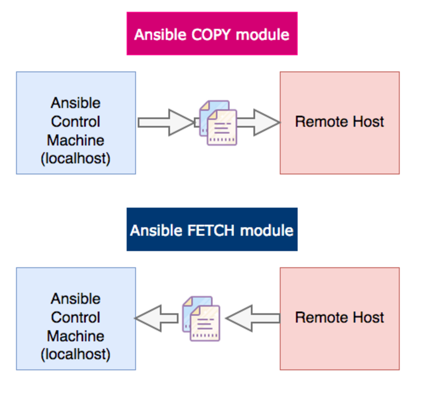
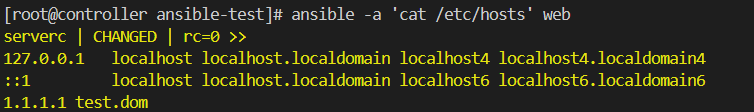
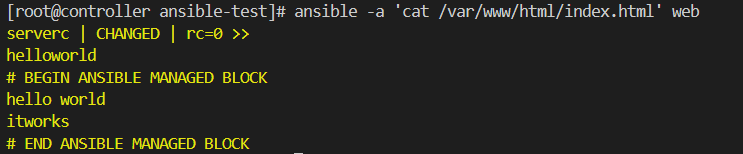
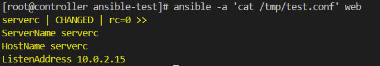

# 파일 관리

## 파일관리 일반 모듈

- Linux 파일 관리와 관련하여 일반적으로 사용되는 대부분의 모듈은 ansible.builtin 컬렉션에 ansible-core 와 함께 제공된다.
- 파일의 권한 및 기타 속성의 생성, 복사, 편집, 수정과 같은 작업을 수행한다.

<br/>

**[ 자주 사용되는 파일 관리 모듈의 목록 ]**

| 모듈 | 설명 |
| --- | --- |
| **lineinfile** | • 특정 행이 파일에 있는지 확인하거나 역참조 정규식을 사용하여 기존행의 내용을 변경.  |
| **blockinfile** | • 마커 선으로 둘러싸인 여러 줄의 텍스트 블록을 삽입 및 업데이트 또는 제거 |
| **copy** | • 특정 파일을 관리호스트의 특정 위치로 복사   <br/> • file모듈과 유사한 속성을 지님 |
| **fetch** | • copy와 반대로 동작  <br/> • 관리호스트의 파일을 제어노드로 가져와 저장. |
| **file** | • 권한, 소유권, SELinux 컨텍스트, 일반 파일의 타임 스탬프, 심볼릭 링크, 하드 링크 및 디렉터리와 같은 속성을 설정    <br/> • 일반 파일, 심볼릭 링크, 하드 링크 및 디렉터리를 생성하거나 제거 |
| **stat** | • linux stat 명령어와 유사     <br/> • 파일의 상태 정보를 조회 |

<br/>

### **1) *file* 모듈**

**[ selinux 컨텍스트 설정 ]**

```yaml
### file.yaml
---
- name: set context
  hosts: web
  tasks:
    - name: create file
      file:
        path: /tmp/samba_file
        owner: ansible-user
        mode: '0640'
        state: touch

    - name: selinux config
      file:
        path: /tmp/samba_file
        setype: samba_share_t
```

```bash
# 파일 확인
$ ansible -a 'ls -alZ /tmp' web

$ ls -Z samba_file
-rw-r--r--.  owner group unconfined_u:object_r: samba_share_t :s0 samba_file
```

<br/>

**[ 파일 제거 ]**

```yaml
### delete-file.yaml
---
- name: set context
  hosts: web
  tasks:
    - name: delete file
      file:
        path: /tmp/samba_file
        state: absent    # 해당 파일이 존재하는 경우, 삭제 작업 수행
```

<br/>

<details>
<summary>💡 selinux란? </summary>

- 관리자가 시스템 액세스 권한을 효과적으로 제어할 수 있는 **Linux 시스템용 보안 아키텍처**
- 전통적으로 Linux와 UNIX 시스템은 *DAC*를 사용했다.
    
      DAC를 사용하면 파일과 프로세스에 소유자가 있다.
      사용자가 파일을 소유하거나, 그룹이 파일을 소유하거나, 다른 사람 등 기타 주체가 파일을 소유하도록 할 수 있다.
      사용자는 자신의 파일에 대한 권한을 변경할 수 있다.
      
      루트 사용자는 DAC 시스템에서 전체 액세스 제어 권한을 소유할 수 있다.
      루트 액세스 권한이 있으면 기타 모든 사용자의 파일에 액세스하거나 시스템에서 원하는 모든 작업을 수행할 수 있다. 
    
- SELinux는 **Linux용 *MAC* 시스템**의 한 예
    - 액세스에 대한 관리 정책을 설정
- **SELinux 정책**
    - 홈 디렉터리의 DAC 설정이 변경되더라도 다른 사용자나 프로세스가 디렉터리에 액세스하지 못하도록 한다.
    - → 구체적인 사항까지 제어하고 많은 프로세스를 다룰 수 있다.
    - ⇒ **시스템을 안전하게 유지 가능**
- 사용자, 파일, 디렉터리 등의 **액세스를 제한하도록 변경 가능**
- code snippet를 통한 공격 방지 가능
- `semange` 명령어로 관리

[참고](https://www.redhat.com/ko/topics/linux/what-is-selinux)

</details>

<br/>

### 2) *copy* 모듈

- 작업 디렉토리의 파일을 관리 호스트로 복사
- 이때, selinux 타입이나 권한 설정을 변경할 수 있다.

```yaml
- name: copy file
  copy:
    src: file
    dest: /path/to/file
```



<br/>

### 3) *fetch* 모듈

- 관리 호스트의 파일을 제어노드로 복사해올 때 사용

```yaml
- name: fetch from host
  fetch: 
    src: "/home/{{ user }}/.ssh/id_rsa.pub"
    dest: "files/keys/{{ user }}.pub"
```

<br/>

### 4) *stat* 모듈

- Linux stat 명령과 유사하게 파일의 팩트를 검색
- 매개 변수는 파일 속성을 검색
- 파일의 체크섬 확인 등의 기능 제공

```yaml
- name: verify checksum
  stat:
    path: /path/to/file
    checksum_algorithm: md5
  register: result

- debug:
    msg: "Checksum is {{ result.stat.checksum }}"

```

<br/>

### 5) *lineinfile* & *blockinfile* 모듈

- 파일의 내용을 확인하고 수정하도록 지원
- 단일 행을 수정하거나 혹은 여러 줄에 걸쳐 수정하도록 지원
- 해당 라인이 이미 존재하면 changed 되지 않는다.

```yaml
### lineinfile.yaml
---
- name: lineinfile test
  hosts: web
  tasks: 
    - name: add new line
      lineinfile:
        line: '1.1.1.1 test.dom'
        path: /etc/hosts
        state: present
        # 해당 라인 삭제
        # state: absent
```


<br/>

```yaml
### blockinfile.yaml
---
- name: block in file
  hosts: web
  gather_facts: no
  tasks:
    - name: block add
      blockinfile:
        # > 기호: 가독성을 위해 한 줄을 끊어서 작성할 수 있게 해줌.
        block: |
          hello world
          itworks
        path: /var/www/html/index.html
```


<br/>

### 6) ***template*** 모듈

- 템플릿 파일을 통해 관리 호스트에 구성 파일을 배포 하기 위해 사용
- ***copy*** 모듈과 마찬가지로 **src와 dest 속성을 지정**

```yaml
tasks:
  - template:
      src: /tmp/j2-template.j2
      dest: /tmp/dest-config-file.txt
```

<br/>

## 템플릿 파일

- 템플릿을 **정의**하고 원하는 값을 **자동으로 가져와 변수로 지정**하여 **치환**한 뒤 **파일의 내용을 구성**하도록 지원


<br/>

**[ Jinja2 템플릿 문법 ]**

- 파일이 배포될 때 **표현식**으로 구성하거나 **변수 및 팩트**를 사용하여 **자동으로 사용자 지정되는 템플릿 구성 파일**을 작성할 수 있다.
- 변수 및 논리 표현식은 **태그 사이 또는 구분 기호 사이에 입력**한다.

<br/>

| 표현식 | 설명 |
| --- | --- |
| `{{ EXPR }}` | Jinja2 템플릿을 평가할 때, 해당 표현식이나 변수의 결과로 바뀜 |
| `` | 코드를 반복하거나 테스트를 수행하는 특수 제어 구조에 사용 |
| `{# COMMENT #}` | 주석을 묶는 데 사용 |

```yaml
{# /etc/hosts line #} 
{{ ansible_facts['default_ipv4']['address'] }}    {{ ansible_facts['hostname'] }}
```

<br/>

**[ Jinja2 템플릿 ]**

- 데이터, 변수 및 식의 여러 요소로 구성된다.
- 변수&식: Jinja2 템플릿이 **렌더링되면 동적으로 값이 작성**된다.
- 템플릿에서 사용된 변수: **플레이북의 vars 섹션에서 지정**할 수 있다.
- **관리호스트의 팩트**를 템플릿에서 변수로 사용할 수 있다.
- 템플릿 파일은 대부분 **플레이북을 위한 프로젝트의 templates 디렉터리**에 보관된다.
- 일반적으로 **`.j2`** 파일 확장자가 할당되어 파일이 Jinja2 템플릿 파일임을 나타내고 있다.

```yaml
### config.j2
ServerName {{ ansible_fqdn }}
HostName {{ ansible_hostname }}
ListenAddress {{ ansible_facts['default_ipv4']['address'] }}
```

```yaml
### template.yaml
---
- name: template test
  hosts: web
  tasks:
    - name: copy template config
      template:
        src: config.j2
        dest: /tmp/test.conf
```


<br/>

**[ sshd 설정 템플릿 파일의 예시 ]**

```yaml
# {{ ansible_managed }} 
# DO NOT MAKE LOCAL MODIFICATIONS TO THIS FILE BECAUSE THEY WILL BE LOST 
Port {{ ssh_port }} 
ListenAddress {{ ansible_facts['default_ipv4']['address'] }} 

HostKey /etc/ssh/ssh_host_rsa_key 
HostKey /etc/ssh/ssh_host_ecdsa_key 
HostKey /etc/ssh/ssh_host_ed25519_key 

SyslogFacility AUTHPRIV 

PermitRootLogin {{ root_allowed }} 
AllowGroups {{ groups_allowed }} 

AuthorizedKeysFile /etc/.rht_authorized_keys .ssh/authorized_keys 

PasswordAuthentication {{ passwords_allowed }} 
```