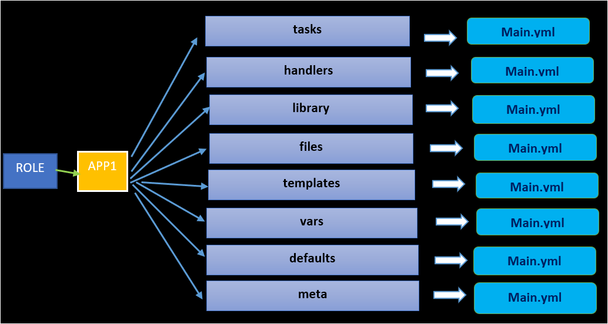

# 역할

- Ansible을 사용하여 복잡하거나 많은 작업을 수행해야 하는 플레이북을 작성한다면 관리하기가 힘들어 질 수 있다.
- 이때 사용자는 여러 개의 플레이북 파일로 분리하여 통합 플레이북에 결합시켜 실행할 수 있다.
- ⇒ 좀 더 가독성을 높이고 관리가 쉽게 구성 가능

<br/>

## 가져오기와 포함하기

- 사용자는 크게 두 가지 방법으로 분리된 파일을 결합할 수 있다.
- **import** 혹은 **include** 키워드를 사용하여 파일을 가져오거나 포함 시킬 수 있다.
- **가져오기(import)**
    - 정적으로 실행
    - 플레이를 실행하는 순간 변수를 읽어오는 변수가 끝날 때까지 그대로
- **포함하기(include)**
    - 동적으로 처리
    - 플레이가 실행되며 변경되는 부분을 바로 반영하여 후속 작업에 영향을 미침

<br/>

### 1) **import_playbook /** **include_playbook**

- 분리된 파일을 결합하는 키워드
- 결합하는 파일은 온전한 플레이북 파일이기 때문에 **플레이북의 최상위 수준에서만 사용**할 수 있으며 **플레이 내에서는 사용할 수 없다.**
- 여러 개의 플레이북을 결합하는 경우 순서대로 실행한다.

```yaml
### 두 개의 추가 플레이북을 결합하는 통합 플레이북
---
- name: database play
  include_playbook: db.yaml
- name: webserver play
  import_playbook: web.yaml
```

<br/>

### 2) **import_tasks / include_tasks**

- **플레이 하위에 작성하는 작업 목록만** 분리한 파일을 결합하는 키워드
- 정적/동적 결합을 지원
- 플레이 레벨이 아니라 하위 레벨이기 때문에 분리된 파일에는 **hosts** 속성은 정의 되어 있지 않는다.

```yaml
---
- name: web server installation
  hosts: webservers
  tasks:
    - import_tasks: webserver_tasks.yaml
```

<br/>

### [ 주의할 점 ]

- **변수를 사용하는 반복문 혹은 조건문을 사용하는 방식이 서로 다름**을 이해한다.
- 예를 들어 **when** 조건을 사용할 때
    - 정적인 `import`를 사용하면, 분리된 파일의 모든 작업에 조건을 적용하여 판단하지만
    - 동적인 `include`를 사용하면, 결합할지에 대한 조건으로 판단하여  결합되고 나면 파일에 있는 모든 작업이 그대로 수행된다.
- 간단히 보면 분리된 파일의 작업을 모두 실행하거나 혹은 **when** 조건을 적용하여 실행하거나 두가지로 나뉘게 된다.
- 분리된 파일에 정의한 변수는 결합한 통합 플레이북에 변수값을 입력할 수 있다.

```yaml
# task.yaml
- name: install {{ package }}
  yum:
    name: "{{ package }}"
    state: present
- name: start {{ service }} 
  service:
    name: "{{ service }}"
    enabled: true
    state: started
```

```yaml
tasks:
  - import_tasks: task.yaml
    vars: 
      package: httpd
      service: httpd
```

<br/>

## 역할 (Role)

- 인프라를 프로비저닝하거나 애플리케이션을 배포하는 데 필요한 모든 작업, 변수, 파일, 템플릿, 기타 리소스를 **표준화된 디렉터리 구조로 패키징**할 수 있다.
    - 포함하거나 가져온 다수의 파일과 다양한 상황을 관리하는 작업 및 핸들러로 인해 플레이가 길고 복잡할 수 있다.
    - 이를 작성한 사람이 만들어 놓은 코드 파일을 공유한다면 다른 사용자는 의미를 파악하거나 논리적인 흐름을 놓쳐 문제가 발생될 여지가 매우 높다.
    - Ansible Role을 사용하면 **일반적인 Ansible 코드를 더 쉽게 재사용**할 수 있다.
    
<br/>       
    
- Role로 구성된 디렉터리를 복사하여 다른 프로젝트로 복사한 다음 플레이 내에서 해당 Role을 호출하면 **훨씬 편하게 공유하고 재사용 할 수 있다.**
    - 잘 작성된 Role은 플레이북에서 변수를 사용해 사이트별 호스트 이름, IP 주소, 사용자 이름, 비밀 또는 기타 로컬의 특정 세부 정보를 설정하여 Role의 동작을 수정할 수 있다.
        - 예시) 데이터베이스 서버를 배포하는 Role은 호스트 이름, 데이터베이스 관리 사용자 및 암호와 설치에 맞게 **사용자 지정된 기타 매개 변수를 설정하는 변수를 지원하도록 작성**할 수 있다.
    - → 개발 및 QA 그리고 프로덕션에서 같은 Role을 사용하지만, **서로 다른 변수 집합을 통해 현재 환경에 맞도록 구성**한다.
    
<br/>    
    
- Role을 호출하는 플레이에 해당 변수를 설정하지 않을 경우, 기본값을 설정한다.
- 자신의 Role을 작성, 사용, 재사용 및 공유하는 것 외에도 **다른 소스에서 Role을 가져올 수 있다.**
    - [Ansible Galaxy 웹 사이트](https://www.notion.so/23ffb6f8175b810faf43e1595df3fb3d?pvs=21)



<br/>

**[ Role의 장점 ]**

- 다른 사용자와 쉽게 공유
- 웹 서버, 데이터베이스 서버 또는 Git 리포지토리와 같은 시스템 유형의 필수 요소를 정의
- 대규모 프로젝트를 쉽게 관리
- 다른 사용자와 동시에  개발

<br/>

### 디렉토리 구조

- 역할은 표준화 된 구조의 디렉토리를 사용
    - 최상위 디렉토리: 역할 이름으로 생성
    - 하위 디렉토리 이름: 각각의 역할에 맞게 정해진 이름을 사용
- 역할에서 변수는 `vars/main.yml` 혹은 `defaults/main.yml`로 정의
- *defaults* 디렉토리: 우선순위가 낮아 기본값을 설정하여 나중에 재정의 할 수 있도록 활용
- *vars* 디렉토리: 우선순위가 높아 인벤토리 변수로는 재정의가 안됨

<br/>

**[ 하위 디렉토리 이름과 역할 ]**

| 디렉토리 | 역할 |
| --- | --- |
| **defaults** | main.yml 파일에 기본 변수와 값을 정의. 우선순위가 낮음 |
| **files** | 작업에서 복사하려는 정적인 파일 저장 |
| **handlers** | main.yml파일에 핸들러 정의 |
| **meta** | main.yml파일에 작성자 라이센스 플랫폼 및 종속성 정보 작성 |
| **tasks** | main.yaml에 작업 내용 정의 |
| **templates** | 템플릿 문법으로 작성된 Jinja2 파일 저장 |
| **tests** | 역할을 테스트 하는데 사용할 수 있는 인벤토리와 test.yml 구성 |
| **vars** | main.yml 파일에 변수값 정의. 우선순위 높음 |

<br/>

## 역할 생성

**[ roles 디렉토리 구성 ]**

- 역할은 *roles* 디렉토리의 하위에 역할 이름으로 디렉토리를 구성한다.
- *roles* 디렉토리의 위치는 기본적으로 `/usr/share/ansible/roles` 혹은 `/etc/ansible/roles` 등으로 지정 되어 있지만
- `ansible.cfg` 파일에서 `defaults` 섹션의 `roles_path` 속성으로 재정의 할 수 있다.

```yaml
[defaults]
...(생략)...
roles_path = /usr/local/roles
```

<br/>

**[ 최상위 & 하위 디렉토리 구성 ]**

- 사용자는 해당 디렉토리 하위에 **역할의 이름으로 역할의 최상위 디렉토리**를 구성하고, **표준화된 하위 디렉토리**를 구성할 수 있다.

```bash
### 작입 디렉토리 하위에 roles 디렉토리를 지정하고
### wordpress 라는 역할을 구성했을 때의 디렉토리 구조
.
├── ansible.cfg
├── inventory
├── roles
│   └── wordpress
│       ├── defaults
│       │   └── main.yml
│       ├── files
│       ├── handlers
│       │   └── main.yml
│       ├── meta
│       │   └── main.yml
│       ├── README.md
│       ├── tasks
│       │   └── main.yml
│       ├── templates
│       ├── tests
│       │   ├── inventory
│       │   └── test.yml
│       └── vars
│           └── main.yml
└── site.yaml
```

<br/>

**[ *ansible-galaxy* 명령어 ]**

- 사용자가 직접 **mkdir** 명령어를 통해 생성하는 대신 **ansible-galaxy** 명령어 사용
- 역할에 대한 정보를 검색하거나 다운로드 및 설치 그리고 제거 등을 지원
- 디렉토리 구조는 해당 명령어를 통해 **기본 구조 스켈레톤 (skeleton)을 자동으로 생성**할 수 있다.
- 역할 이름을 입력해서 최상위 디렉토리를 생성하고, 그 하위에 표준화된 디렉토리를 생성한 뒤 **비어있는 파일 main.yml 등을 자동으로 구성**
- 사용자는 **자동으로 만들어진 디렉토리와 파일**을 통해 **역할 구성을 보다 간편하게 시작**

```bash
### roles 디렉토리에 새로운 역할을 위한 디렉토리 구조를 생성하는 명령어
ansible-galaxy init wordpress
```

<br/>

## 외부 소스에서 역할 구성

- 사용자가 처음부터 수동으로 만드는 대신 **커뮤니티에 다른 사용자가 만든 역할**을 가져와 재사용 할 수 있다.
- *Git 레포지토리* 혹은 *Ansible Galaxy*와 같은 오픈소스 커뮤니티에서 많은 역할을 검색하고 다운로드하여 **로컬환경에 맞도록 재지정 후 사용 가능**

<br/>

**[ *roles/requirements.yml* 파일 ]**

- 설치 및 관리 하고자 하는 역할에 대한 정보는 **roles/requirements.yml** 파일에 입력한다.
- git에 저장된 역할에서 version 정보는 브랜치 이름 , 태그 및 git commit 해시 정보 등으로 입력할 수 있다.
- 만약 버전이 지정되지 않으면 항상 최신 브랜치에서 커밋을 사용한다.

```bash
### github에 사용자가 공유한 역할 디렉토리가 저장되어 있는 경우
# roles/requirements.yml
- src: https://github.com/USERNAME/wordpress.role
  scm: git
  version: "1.5.0"
```

<br/>

**[ *ansible-galaxy role install*  명령어 ]**

- 역할을 설치하기 위해서 사용하는 명령어
- `-r` 옵션: 역할에 대한 정보가 입력되어 있는 파일을 지정
- `-p` 옵션: 설치하려는 대상 디렉토리의 위치 지정
- `-p` 옵션이 생략되었을 때, *ansible.cfg* 파일의 `defaults` 섹션에는 **`roles_path`** 속성을 지원
    - 해당 위치를 지정하는 기본 roles 디렉토리 경로를 입력할 수 있는 속성

```bash
ansible-galaxy role install -r roles/requirements.yml -p roles
```

<br/>

**[ *ansible-galaxy list* 명령어 ]**

- 로컬에 설치한 역할을 확인하는 명령어

```bash
ansible-galaxy list
```

<br/>

**[ *ansible-galaxy remove* 명령어 ]**

- 역할을 삭제하는 명령어

```bash
ansible-galaxy remove wordpress
```

<br/>

## 플레이북에서 역할을 사용하기 위해 호출하는 두 가지 방법

### 1) tasks의 모듈로 정적 혹은 동적으로 추가

- **import_role** 혹은 **include_role**을 사용하는 방법
- 정적/동적인 방법
    - **import_role** : 정적
    - **include_role** : 동적
- 조건문 및 반복문을 사용하는 방식
    - **import_role** : 역할 내부의 각 작업 별로 조건과 반복을 설정
    - **include_role** : 조건과 반복을 전체로 적용
- 해당 역할의 변수와 정적/동적(*jinja2*) 파일 그리고 핸들러와 작업 목록을 가져와 추가하여 플레이북에서 실행한다.
- 역할에 대한 변수는 플레이북에서 정의 할 수 있다.

```yaml
# import_role / include_role
- hosts: import role
  tasks:
    - import_role:
        name: myrole1
    - include_role:
        name: myrole2 
```

```yaml
tasks:
  - import_role:
      name: role1
    vars:
      var1: value1
      var2: value2

```

<br/>

### 2) 플레이에서 roles 키워드를 사용

**[ `roles` 키워드 ]**

- 플레이 수준에서 역할을 호출한다.
- 하위 수준인 작업 목록에서 모듈을 사용하는 이전 방법과는 달리 간편하게 호출 가능하다.

```yaml
- name: sample play
  hosts: all
  roles:
    - role: role1
    - role: role2
```

<br/>

**[ `roles` 실행 순서 ]**

- `tasks` 항목과 같이 작성된다면 `roles`는 항상 `tasks` 항목 이전에 실행된다.
- 다음처럼 `roles` 키워드가 플레이 북에서 후 순위로 나열되어 있다고 하더라도, **실행은 항상 `tasks` 이전에 실행**된다.

```yaml
- name: sample play
  hosts: all
  tasks:
    - debug:
        msg: "Run after roles"
  roles:
    - role: role1
    - role: role2
```

<br/>

**[ 각 역할마다 사용할 변수는 항목 별로 지정 가능 ]**

```yaml
- name: sample play
  hosts: all
  roles:
    - role: role1
      var1: value1
      var2: value2

    - role: role2
```

<br/>

**[ 속기 사용 ]**

- 들여쓰기가 귀찮거나 내용을 축소할 경우 사용
- 권장하지 않음

```yaml
- name: sample play
  hosts: all
  roles:
    - { role: role1, var1: value1, var2: value2 }
    - role: role2
```

<br/>

**[ *pre_tasks* / *post_tasks* ]**

- 역할과 함께 많이 사용하는 작업 순서를 조절하는 키워드
- **pre_tasks**
    - roles 보다 우선 실행된다.
    - 알림을 받은 핸들러 역시 먼저 실행된다.
- **post_tasks**
    - 모든 tasks가 끝난 뒤 핸들러 까지 실행을 마치고 나면 실행한다.
- 아래 예시에서 핸들러는  **`pre_tasks` , `roles/tasks`, `post_tasks`** 가 실행이 끝난 시점에 총 세 번 실행 된다.

```yaml
### 실행 순서를 표현한 예시
- hosts: all
  pre_tasks: 
    - debug: 
        msg: pre_tasks
      notify: myhandler
      changed_when: true
  roles: 
    - role: role1
  tasks:
    - debug: 
        msg: tasks
      notify: myhandler
      changed_when: true
  post_tasks:
    - debug: 
        msg: post_tasks
      notify: myhandler
      changed_when: true
  handlers:
    - name: myhandler
      debug:
        msg: handler 

```

<br/>

## 컬렉션

- Ansible은 필요한 경우 **역할에 필요한 모듈을 직접 개발해서 사용하는 것을 허용**한다.
- ISV에서 직접 개발한 모듈과 플러그인 및 역할을 함께 배포하기 위해 Ansible은 **컬렉션(Collection)을 사용**
- Ansible core 모듈과 별도로 모듈 및 플러그인들을 개발할 수 있다.
    
    > [ 사례 ]
    > 
    > - `redhat.insight` : RHEL 용 모듈 및 역할 제공
    > - `cisco.ios` : 시스코 장비를 지원하는 모듈과 플러그인 제공
    > - `community.crypto` : SSL/TLS 인증서를 생성 관리하는 모듈을 제공
- 컬렉션을 사용하기 위해서 **ansible-galaxy collection** 하위 명령어를 지원

```bash
# 컬렉션 설치 예시 
ansible-galaxy collection install community.crypto \
 -r collections/ requirements.yml \
 -p ./collections
```